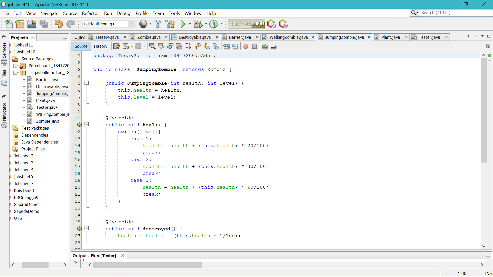

# Laporan Praktikum #10_Polimorfisme

## Kompetensi

1. Memahami konsep dan bentuk dasar polimorfisme
2. Memahami konsep virtual method invication
3. Menerapkan polimorfisme pada pembuatan heterogeneous collection
4. Menerapkan polimorfisme pada parameter/argument method
5. Menerapkan object casting untuk meng-ubah bentuk objek

## Ringkasan Materi

### Pendahuluan
Polimorfisme

Polimorfisme merupakan kemampuan suatu objek untuk memiliki banyak bentuk. 
Penggunaan polimorfisme yang paling umum dalam OOP terjadi ketika ada referensi super 
class yang digunakan untuk merujuk ke objek dari sub class. Dengan kata lain, 
ketika ada suatu objek yang dideklarasikan dari super class, maka objek tersebut bisa diinstansiasi sebagai objek 
dari sub class. Dari uraian tersebut bisa dilihat bahwa konsep polimorfisme bisa diterapkan pada class-class yang memiliki relasi inheritance (relasi generalisasi atau IS-A).
Selain pada class-class yang memiliki relasi inheritance, polimorfisme juga bisa diterapkan pada interface. 
Ketika ada objek yang dideklarasikan dari suatu interface, maka ia bisa digunakan untuk mereferensi ke objek dari class-class yang implements ke interface tersebut. 

#### Virtual method invocation
Virtual method invocation terjadi ketika ada pemanggilan overriding method dari suatu objek polimorfisme. 
Disebut virtual karena antara method yang dikenali oleh compiler dan method yang dijalankan oleh JVM berbeda.

#### Heterogeneous Collection 
Dengan adanya konsep polimorfisme, maka variabel array bisa dibuat heterogen. Artinya di dalam array tersebut bisa berisi berbagai macam objek yang berbeda. 

#### Polymorphic Argument 
Polimorfisme juga bisa diterapkan pada argument suatu method. Tujuannya agar method tersebut bisa menerima nilai argument dari berbagai bentuk objek.

#### Operator instanceof 
Operator instanceof bisa digunakan untuk mengecek apakah suatu objek merupakan hasil instansiasi dari suatu class tertentu. Hasil dari instanceof berupa nilai boolean

#### Object Casting 
Casting objek digunakan untuk mengubah tipe dari suatu objek. Jika ada suatu objek dari subclass kemudian tipenya diubah ke superclass, maka hal ini termasuk ke upcasting.

## Studi Kasus

## Percobaan

### Percobaan 1

#### employe

[Employee](../../src/10_Polimorfisme/Employee.java)

#### Payable

[Payable](../../src/10_Polimorfisme/Payable.java)

#### InternshipEmployee

[InternshipEmployee](../../src/10_Polimorfisme/InternshipEmployee.java)

#### PermanentEmployee

[PermanentEmployee](../../src/10_Polimorfisme/PermanenEmployee.java)

#### ElectricityBill

[ElectricityBill](../../src/10_Polimorfisme/ElectricityBill.java)

#### Tester1

[Tester1](../../src/10_Polimorfisme/Tester1.java)

#### Pertanyaan
1. Class apa sajakah yang merupakan turunan dari class Employee?
> jawab : 
class IntershipEmployee dan class PermanenrEmployee

2. Class apa sajakah yang implements ke interface Payable?
> jawab : 
class ElectricityBill dan class PermanentEmployee 

3. Perhatikan class Tester1, baris ke-10 dan 11. Mengapa e, bisa diisi dengan objek pEmp (merupakan objek dari class
PermanentEmployee) dan objek iEmp (merupakan objek dari class
InternshipEmploye) ?
> jawab : 
Karena pEmp dan iEmp merupakan turunan class Employee, yaitu dimana class Employee diinstasiasi dengan objek e

4. Perhatikan class Tester1, baris ke-12 dan 13. Mengapa p, bisa diisi
dengan objek pEmp (merupakan objek dari class
PermanentEmployee) dan objek eBill (merupakan objek dari class
ElectricityBill) ?
> jawab : 
Karena class pEmp dan eBill merupakan implentasi dari class Interface Payable

5. Coba tambahkan sintaks:
p = iEmp;
e = eBill;
pada baris 14 dan 15 (baris terakhir dalam method main) ! Apa yang
menyebabkan error?
> jawab : 
Karena iEmp bukan merupakan implements dari class Payable -  eBill bukan merupakan turunan dari class Employee

6. Ambil kesimpulan tentang konsep/bentuk dasar polimorfisme!
> jawab : 
Jadi ketika ada oject yang di deklarasikan sebagai parent class, maka object tersebut juga bisa diinstansiasi sebagai object dari sub class  

### Percobaan 2

#### Tester2

[Tester2](../../src/10_Polimorfisme/Tester2.java)

#### Pertanyaan

1. Perhatikan class Tester2 di atas, mengapa pemanggilan
e.getEmployeeInfo() pada baris 8 dan
pEmp.getEmployeeInfo() pada baris 10 menghasilkan hasil
sama?
> jawab : 
Karena pada baris ke 7 sudah dideklarasikan bahwa object e merupakan pEmp.

2. Mengapa pemanggilan method e.getEmployeeInfo() disebut
sebagai pemanggilan method virtual (virtual method invication),
sedangkan pEmp.getEmployeeInfo() tidak?
> jawab : 
karena terjadi pemanggilan method ovverriding sari suatu object polimorfisme

3. Jadi apakah yang dimaksud dari virtual method invocation? Mengapa
disebut virtual?
> jawab : 
Virtual method invocation terjadi ketika ada pemanggilan overriding method dari suatu object polimorfisme. Karena antara method yang dikenali oleh compiler dan method yang dijalankan oleh JVM berbeda.

### Percobaan 3  Heterogenous Collection 

#### Tester 3

[Tester3](../../src/10_Polimorfisme/Tester3.java)

#### Pertanyaan

1. Perhatikan array e pada baris ke-8, mengapa ia bisa diisi dengan
objek-objek dengan tipe yang berbeda, yaitu objek pEmp (objek dari
PermanentEmployee) dan objek iEmp (objek dari
InternshipEmployee) ?
> jawab : 
Karena class Employee merupakan parent dari class pEmp dan iEmp

2. Perhatikan juga baris ke-9, mengapa array p juga biisi dengan objekobjek
dengan tipe yang berbeda, yaitu objek pEmp (objek dari
PermanentEmployee) dan objek eBill (objek dari
ElectricityBilling) ?
> jawab : 
Karena class interfaces Payable mengimplementasikan pada class pEmp dan eBill

3. Perhatikan baris ke-10, mengapa terjadi error?
> jawab :
Karena eBill bukan termasuk Class turunan dari Class Employee. 

### Percobaan 4  Argumen polimorfisme,instanceod dan casting objek 

#### Owner 

[OWNER](../../src/10_Polimorfisme/Owner.java)

#### Tester4

[Tester4](../../src/10_Polimorfisme/Tester4.java)

### Pertanyaan

1. Perhatikan class Tester4 baris ke-7 dan baris ke-11, mengapa
pemanggilan ow.pay(eBill) dan ow.pay(pEmp) bisa dilakukan,
padahal jika diperhatikan method pay() yang ada di dalam class
Owner memiliki argument/parameter bertipe Payable? Jika
diperhatikan lebih detil eBill merupakan objek dari
ElectricityBill dan pEmp merupakan objek dari
PermanentEmployee?
> jawab : 
Pada class Tester4 baris ke-7 dan baris ke-11, pemanggilan ow.pay(eBill) dan ow.pay(pEmp) bisa dilakukan, padahal jika diperhatikan method pay() yang ada di dalam class Owner memiliki argument/parameter bertipe Payable karena keduanya sama - sama mengimplementasikan interface Payable.
atau 
Karena owner memiliki method pay yang berisi konstruktor Payable, Sedangkan pada interface Payable mengimplementasikan pada class ElectricityBill(eBill) dan class  PermanentEMployee(pEmp)

2. Jadi apakah tujuan membuat argument bertipe Payable pada
method pay() yang ada di dalam class Owner?
> jawab :
Bertujuan untuk menerima nilai argument dari berbagai object 

3. Coba pada baris terakhir method main() yang ada di dalam class
Tester4 ditambahkan perintah ow.pay(iEmp);
Mengapa terjadi error?
> jawab :
Karena iEmp bukan implements dari interface PayAble

4. Perhatikan class Owner, diperlukan untuk apakah sintaks p
instanceof ElectricityBill pada baris ke-6 ?
> jawab :
Untuk mengecek apakah object yang dimasukkan sebagai implements dari Payable atau tidak.

5. Perhatikan kembali class Owner baris ke-7, untuk apakah casting
objek disana (ElectricityBill eb = (ElectricityBill) p)
diperlukan ? Mengapa objek p yang bertipe Payable harus di-casting
ke dalam objek eb yang bertipe ElectricityBill ?
> jawab :
Untuk dikembalikan ke instan sesungguhnya sehingga dapat memanggil method getBillInfo() yang hanya ada di class ElectricityBill.
atau
digunakan untuk mengubah tipe dari suatu objek. Jika ada suatu objek dari subclass kemudian tipenya diubah ke superclass,maka disebut upcasting.

## Tugas

Dalam suatu permainan, Zombie dan Barrier bisa dihancurkan oleh Plant dan
bisa menyembuhkan diri. Terdapat dua jenis Zombie, yaitu Walking Zombie
dan Jumping Zombie. Kedua Zombie tersebut memiliki cara penyembuhan
yang berbeda, demikian juga cara penghancurannya, yaitu ditentukan oleh
aturan berikut ini:
• Pada WalkingZombie 
=>  Penyembuhan : Penyembuhan ditentukan berdasar level
zombie yang bersangkutan
-  Jika zombie level 1, maka setiap kali penyembuhan,
health akan bertambah 20%
- Jika zombie level 2, maka setiap kali penyembuhan,
health akan bertambah 30%
- Jika zombie level 3, maka setiap kali penyembuhan,
health akan bertambah 40%
=> Penghancuran : setiap kali penghancuran, health akan
berkurang 2%

• Pada Jumping Zombie  
=>  Penyembuhan : Penyembuhan ditentukan berdasar level
zombie yang bersangkutan
- Jika zombie level 1, maka setiap kali penyembuhan,
health akan bertambah 30%
- Jika zombie level 2, maka setiap kali penyembuhan,
health akan bertambah 40%
- Jika zombie level 3, maka setiap kali penyembuhan,
health akan bertambah 50%

=> Penghancuran : setiap kali penghancuran, health akan
berkurang 1%

jawab :

[Barrier](../../src/10_Polimorfisme/Barrier.java)

[Destroyable](../../src/10_Polimorfisme/Destroyable.java)

[JumpingZombie](../../src/10_Polimorfisme/JumpingZombie.java)

[Plant](../../src/10_Polimorfisme/Plant.java)

[WalkingZombie](../../src/10_Polimorfisme/WalkingZombie.java)

[Zombie](../../src/10_Polimorfisme/Zombie.java)

[TESTER](../../src/10_Polimorfisme/Tester.java)

## Kesimpulan
Pada pratikum ini kita dapat Memahami konsep dan bentuk dasar polimorfisme, Memahami konsep virtual method invication, Menerapkan polimorfisme pada pembuatan heterogeneous collection, Menerapkan polimorfisme pada parameter/argument method, Menerapkan object casting untuk meng-ubah bentuk objek 

## Pernyataan Diri

Saya menyatakan isi tugas, kode program, dan laporan praktikum ini dibuat oleh saya sendiri. Saya tidak melakukan plagiasi, kecurangan, menyalin/menggandakan milik orang lain.

Jika saya melakukan plagiasi, kecurangan, atau melanggar hak kekayaan intelektual, saya siap untuk mendapat sanksi atau hukuman sesuai peraturan perundang-undangan yang berlaku.

Ttd,

***(Mochammad Adam's Arzaqi)***

