# Laporan Praktikum #11 - GUI

## I. Kompetensi 
Setelah menyelesaikan lembar kerja ini mahasiswa diharapkan mampu: 
1. Membuat aplikasi Graphical User Interface sederhana dengan bahasa pemrograman java; 
2. Mengenal komponen GUI seperti frame, label, textfield, combobox, radiobutton, checkbox, textarea, menu, serta table; 
3. Menambahkan event handling pada aplikasi GUI. 

## Ringkasan Materi

 Swing merupakan bagian dari JFC (Java Foundation Classes) yang menyediakan API untuk menangani hal yang berkaitan dengan GUI bagi program Java.  Kita bisa membedakan komponen Swing dengan komponen AWT, di mana pada umumnya kelas-kelas yang berada dalam komponen Swing diawali dengan huruf J, misal: JButton, JLabel, JTextField, JRadioButton.

 ## Percobaan 1: JFrame HelloGUI 

 Langkah-Langkah Praktikum 
 1. Buatlah sebuah project baru di NetBeans dengan nama HelloGui 
 2. Tambahkan paket Java ke dalam kode program, import javax.swing.*; 
 3. Pada program utama main(), tuliskan script code berikut 
 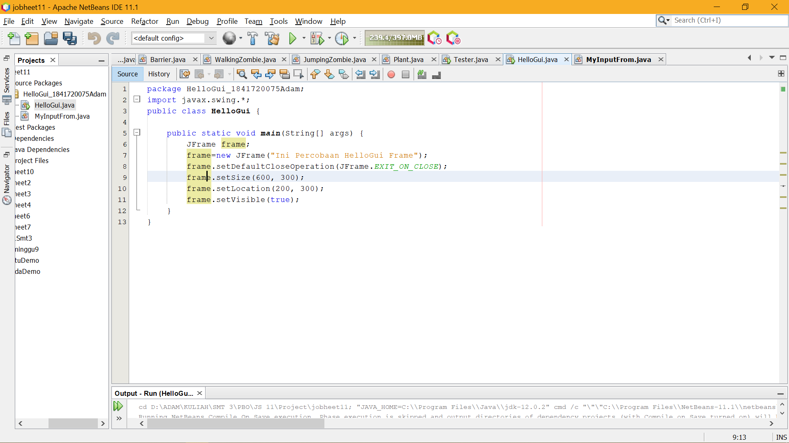

 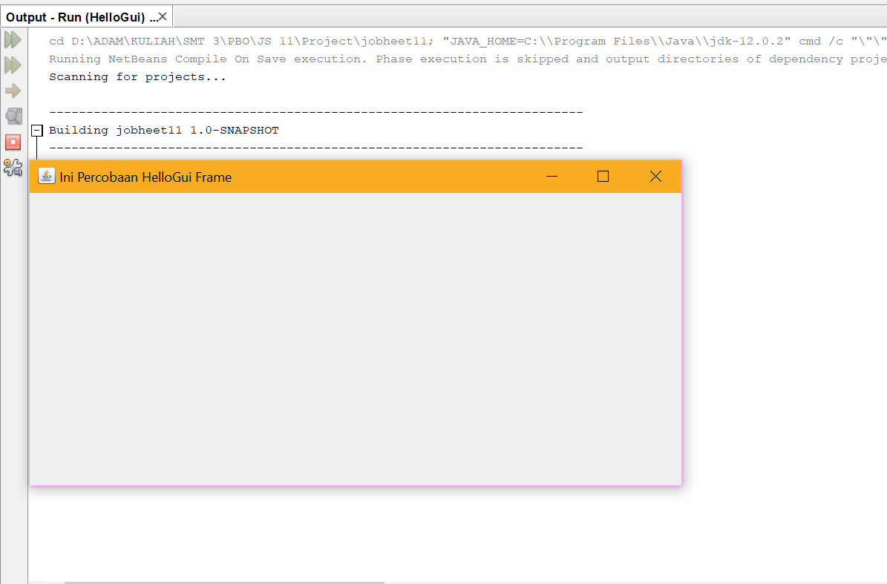

 Link Kode Program [GUI](../../src/11_GUI/HelloGui.java)

 ## Percobaan 2: Menangani Input Pada GUI 

 Selanjutnya adalah bagaimana memanfaatkan komponen-komponen GUI pada Java untuk menangani inputan, dengan memanfaatkan JFrame, JButton, JLabel, JTextField, JPanel dsb

 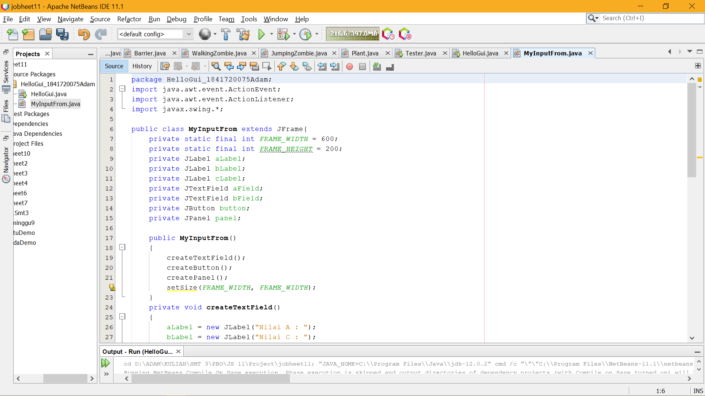
  
  Link Kode Program [GUI](../../src/11_GUI/MyInputFrom.java)

 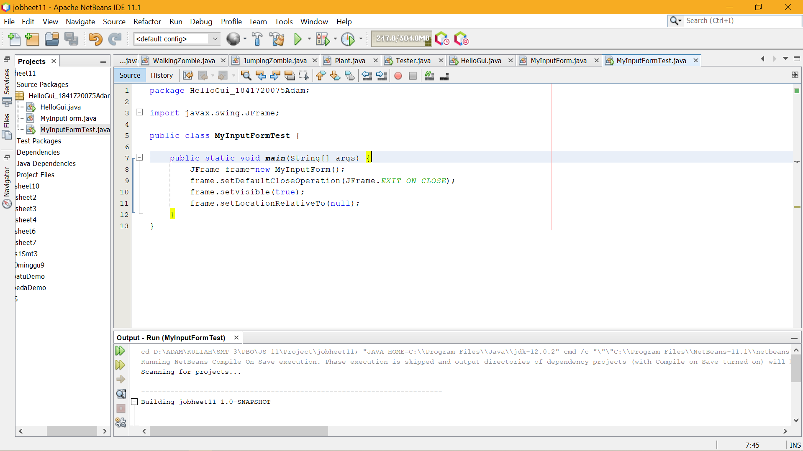

 Link Kode Program [GUI](../../src/11_GUI/MyInputFormTest.java)

 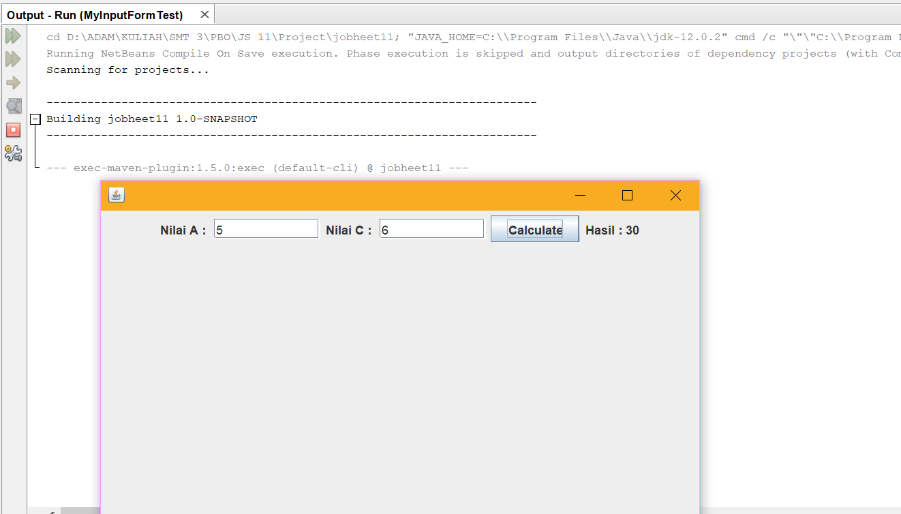

## Pertanyaan 
a) Modifikasi kode program dengan menambahkan JButton baru untuk melakukan fungsi perhitungan penambahan, sehingga ketika button di klik (event click) maka akan menampilkan hasil penambahan dari nilai A dan B 

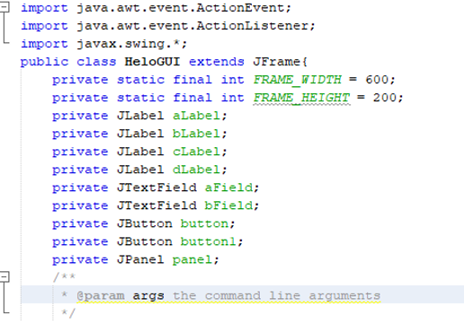

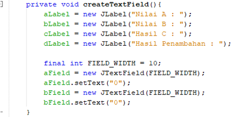

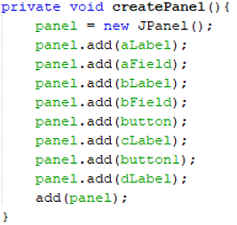

## Percobaan 3: Manajemen Layout 

Java GUI menyediakan beberapa layout yang dapat digunakan pada program. Pada modul praktikum ini akan dijelaskan 3 contoh GUI layout, yaitu: 

a) Border layout

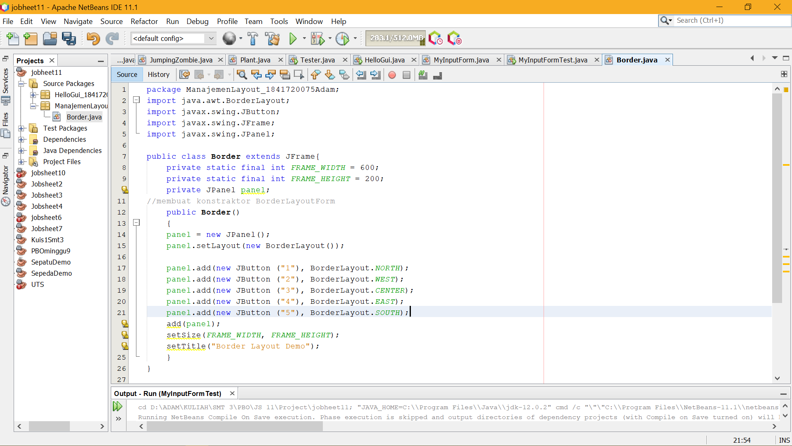

Link Kode Program [GUI](../../src/11_GUI/Border.java)

b) Grid layout  

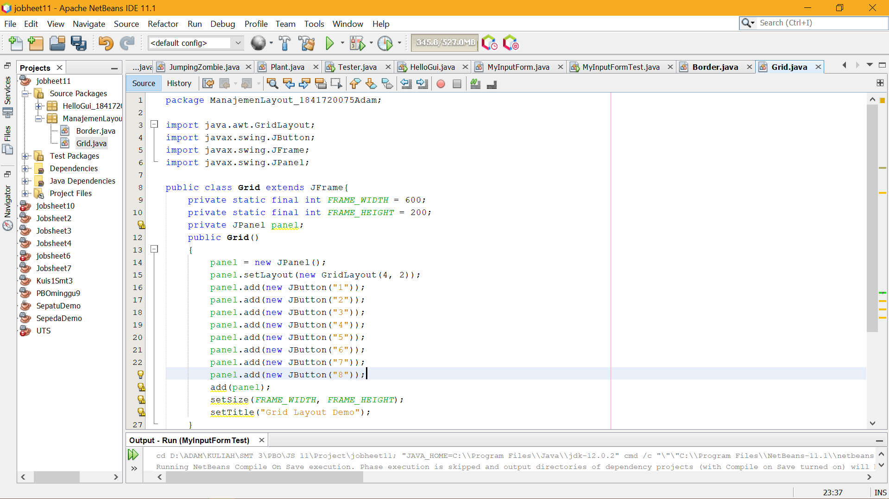

Link Kode Program [GUI](../../src/11_GUI/Grid.java)

c) Box layout

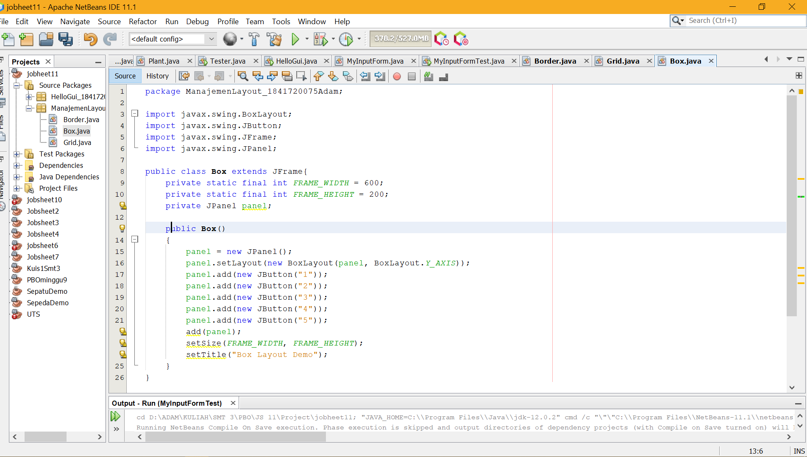

Link Kode Program [GUI](../../src/11_GUI/Box.java)

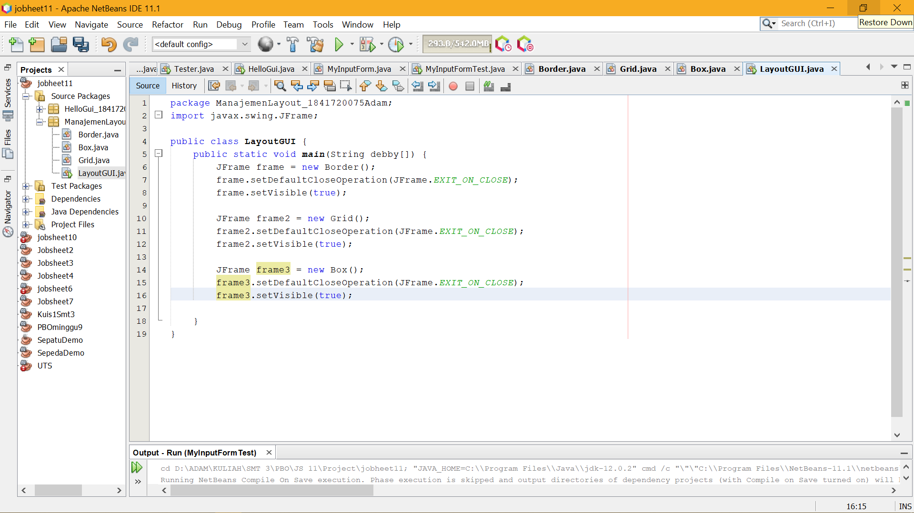

Link Kode Program [GUI](../../src/11_GUI/LayoutGUI.java)

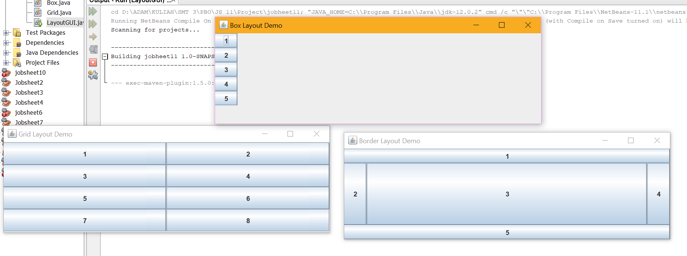

## Pertanyaan 

a) Apa perbedaan dari Grid Layout, Box Layout dan Border Layout? 

-	Border yaitu komponen berdasarkan lokasi geografis, NORTH, SOUTH, EAST, WES T, and CENTER. 
-	Grid yaitu menempatkan komponen dengan urutan dari kiri ke kanan dan dari atas ke bawah. GridLayout akan memaksa setiap komponen untuk menempati space container yang kosong serta membagi rata ukuran space tersebut
-	Box yaitu menempatkan komponen dalam satu baris atau satu kolom.

b) Apakah fungsi dari masing-masing kode berikut?

-	JFrame frame = new Border(), JFrame frame2 = new Grid(),JFrame frame3 = new Box() 
-	frame.setDefaultCloseOperation(JFrame.EXIT_ON_CLOSE) untuk  menentukan operasi ketika frame ditutup
-	frame.setVisible(true) untuk  menampilkan frame, dimana parameter berisi tipe data yang bernilai true

## Percobaan 4: Membuat GUI Melalui IDE Netbeans 

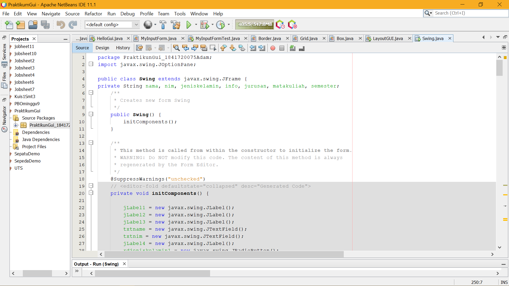

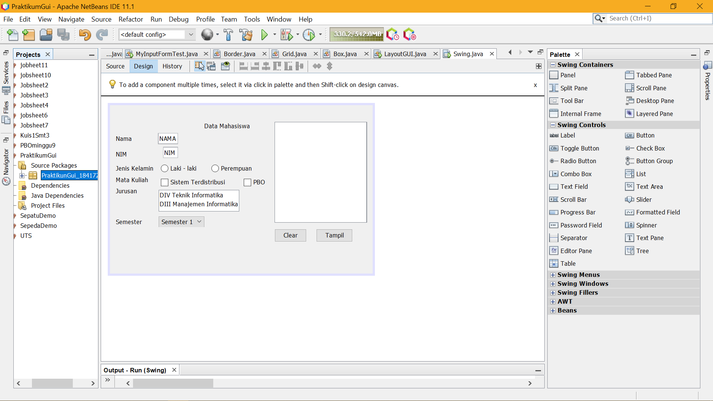

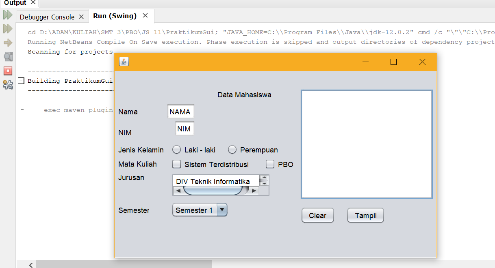

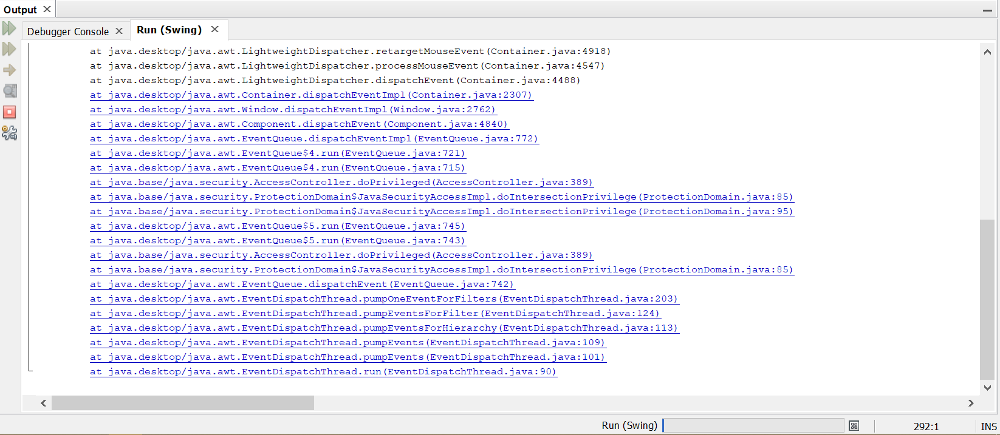

Link Kode Program [GUI](../../src/11_GUI/Swing.java)

## Kesimpulan

Pada praktikum ini lebih ditekankan pada menampilkan suatu code agar lebih menarik.

nb : Saya sedikit belum paham mengenai gui atau praktikum ini

## Pernyataan Diri

Saya menyatakan isi tugas, kode program, dan laporan praktikum ini dibuat oleh saya sendiri. Saya tidak melakukan plagiasi, kecurangan, menyalin/menggandakan milik orang lain.

Jika saya melakukan plagiasi, kecurangan, atau melanggar hak kekayaan intelektual, saya siap untuk mendapat sanksi atau hukuman sesuai peraturan perundang-undangan yang berlaku.

Ttd,

***(Mochammad Adam's Arzaqi)***
