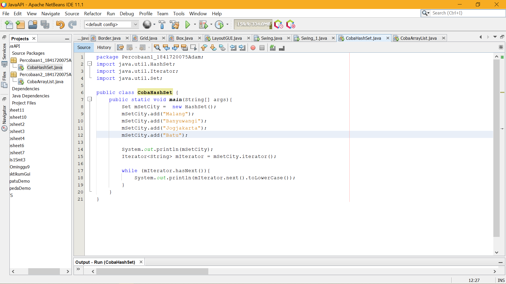
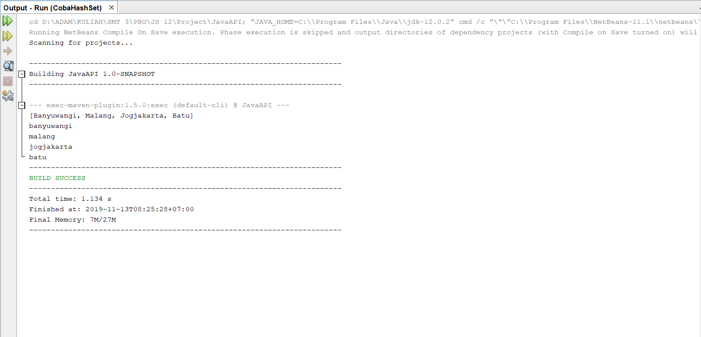
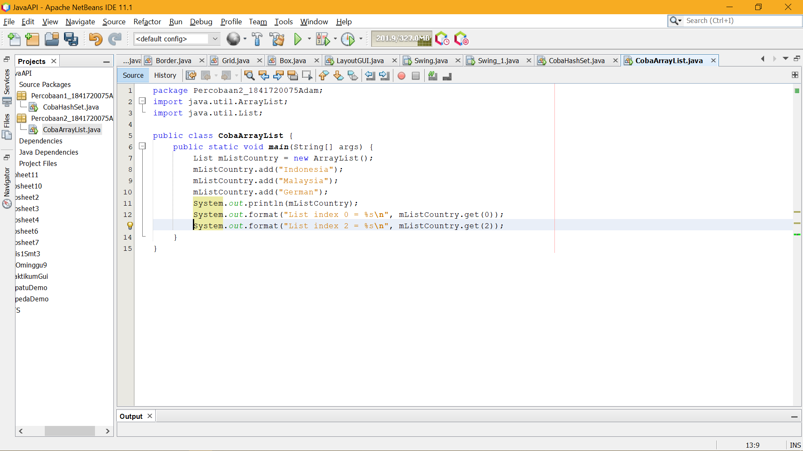
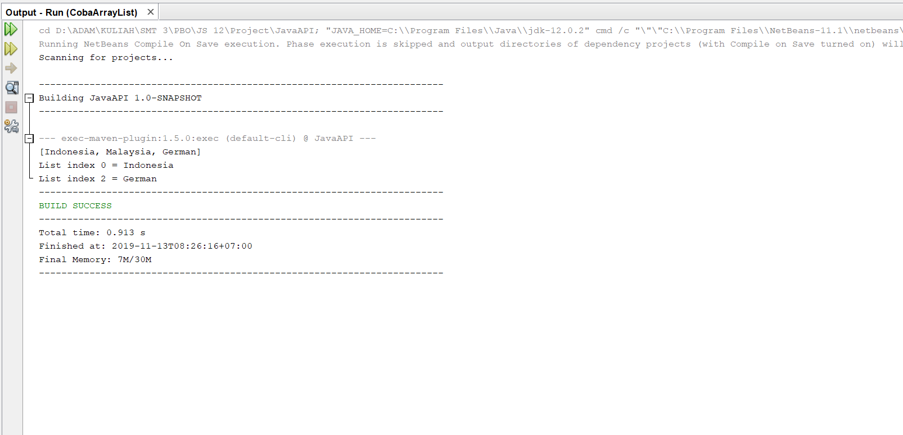
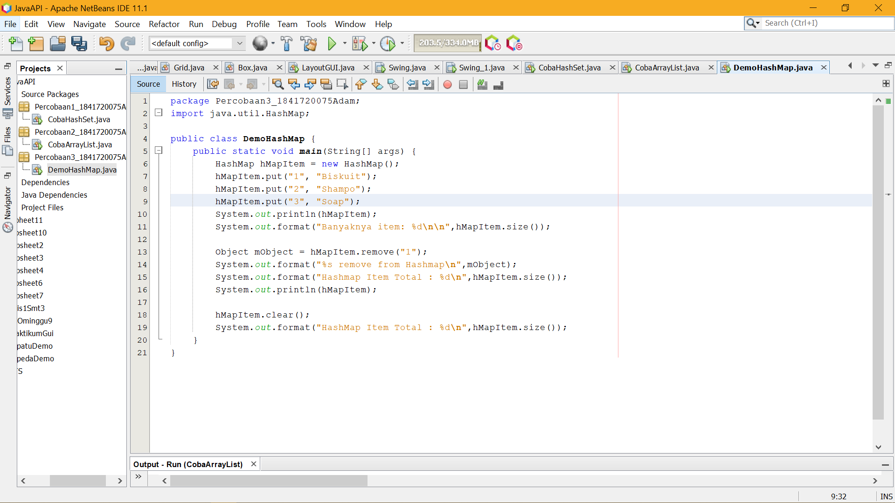
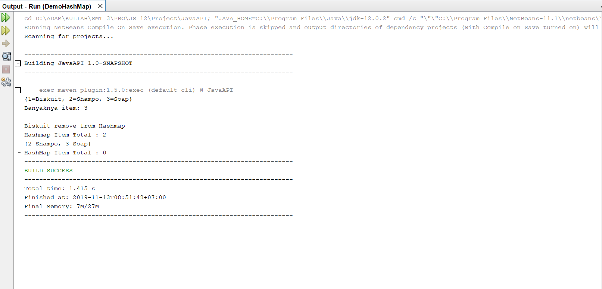

# Jobsheet Minggu ke-12 Collection (List, Set, Map) dan Database

## Kompetensi

1. Memahami cara penyimpanan objek menggunakan Collection dan Map. 
2. Mengetahui pengelompokan dari Collection. 
3. Mengetahui perbedaan dari interface Set, List dan Map. 
4. Mengetahui penggunaan class-class dari interface Set, List, dan Map. 
5. Memahami koneksi database menggunakan JDBC dan JDBC API 

## Ringkasan Materi

Collection adalah suatu objek yang bisa digunakan untuk menyimpan sekumpulan objek. Objek yang ada dalam Collection disebut elemen. Collection menyimpan elemen yang bertipe Object, sehingga berbagai tipe object bisa disimpan dalam Collection. Class-class mengenai Collection tergabung dalam Java Collection Framework. Class-class Collection diletakkan dalam package java.util dan mempunyai dua interface utama yaitu Collection.

## Percobaan 1 (Set)
1. Bukalah program Netbeans IDE yang sudah terinstal dikomputer anda! 
2. Buatlah project baru dengan nama JavaApi, ilustrasi project dapat dilihat pada gambar dibawah ini: 
3. Setelah itu buatlah package dengan nama identifier.percobaan1, misalnya : arie.percobaan1. 
4. Pada package tersebut buatlah java class dengan nama DemoHashSet. 
5. Tambahkan source code yang ada di method main()  kedalam class yang sudah anda buat!

6. Jalankan program diatas, dan amati apa yang terjadi! 

Link Kode Program [JAVA_API](../../src/12_Java_API/CobaHashSet.java)

## Pertanyaan
1. Apakah fungsi import java.util.*; pada program diatas!
2. Pada baris program keberapakah yang berfungsi untuk menciptakan object HashSet?
3. Apakah fungsi potongan program dibawah ini pada percobaan 1! 
4. Tambahkan set.add(“Malang”); kemudian jalankan program! Amati hasilnya dan jelaskan mengapa terjadi error!
5. Jelaskan fungsi potongan program dibawah ini pada percobaan 1!

## Percobaan 2 (List)
### Langkah Percobaan (ArrayList) 
1. Buatlah package dengan nama identifier.percobaan2  pada project yang sudah anda buat sebelumnya, misalnya : arie.percobaan2. 
2. Tambahkan source code berikut pada class yang sudah anda buat! 

3. Jalankan program diatas! 

Link Kode Program [JAVA_API](../../src/12_Java_API/CobaArrayList.java)

## Pertanyaan 
1. Apakah fungsi potongan program dibawah ini! 
2. Ganti potongan program pada soal no 1 menjadi sebagai berikut  
Kemudian jalankan program tersebut!
3. Jelaskan perbedaan menampilkan data pada ArrayList menggunakan potongan program pada soal no 1 dan no 2!

## Percobaan 3 (Map)
### Langkah Percobaan 
1. Buatlah package dengan nama identifier.percobaan3  pada project yang sudah anda buat sebelumnya, misalnya : arie.percobaan3. 
2. Buatlah class baru dengan nama DemoHashMap. Tambahkan source code dibawah ini kedalam class!

3. Jalankan program diatas, maka outputnya adalah sebagai berikut: 

Link Kode Program [JAVA_API](../../src/12_Java_API/DemoHashMap.java)

### Pertanyaan 
1. Jelaskan fungsi hMapItem.put("1","Biskuit") pada program!
2. Jelaskan fungsi hMapItem.size() pada program!
3. Jelaskan fungsi hMapItem.remove("1") pada program!
4. Jelaskan fungsi hMapItem.clear() pada program!
5. Tambahkan kode program yang di blok pada program yang sudah anda buat!  
6. Jalankan program dan amati apa yang terjadi! 
7. Apakah perbedaan program sebelumnya dan setelah ditambahkan kode program pada soal no 5 diatas? Jelaskan!

## Pernyataan Diri

Saya menyatakan isi tugas, kode program, dan laporan praktikum ini dibuat oleh saya sendiri. Saya tidak melakukan plagiasi, kecurangan, menyalin/menggandakan milik orang lain.

Jika saya melakukan plagiasi, kecurangan, atau melanggar hak kekayaan intelektual, saya siap untuk mendapat sanksi atau hukuman sesuai peraturan perundang-undangan yang berlaku.

Ttd,

***(Mochammad Adam's Arzaqi)***