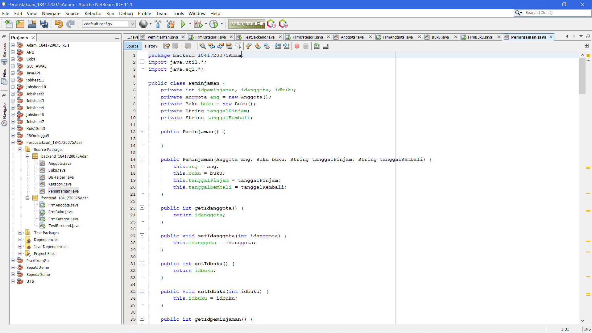

# Jobsheet Minggu ke-14 GUI dan Database

## Kompetensi

1. Menggunakan paradigma berorientasi objek untuk interaksi dengan database 
2. Membuat backend dan frontend 
3. Membuat form sebagai frontend 

## Ringkasan Materi

Kali ini kita akan menggunakan paradigma berorientasi objek yang telah kita pelajari untuk membuat aplikasi berbasis database dan dilengkapi dengan form sebagai Graphical User Interface (GUI).

## Percobaan 1
Langkah pertama untuk percobaan ini adalah membuat database. Install XAMPP, buka phpMyAdmin, buat database dbperpus

## Percobaan 2 
Mempersiapkan project. 
1. Buat project baru, beri nama Perpustakaan. 
2. Pada project explorer, klik kanan pada Libraries → Add Library, pilih MySQL JDBC Driver. 
3. Buat package frontend dan backend. Cara membuat package adalah, pada project explorer, klik kanan pada Source Packages → New → Java Package, beri nama package nya (frontend, backend).

## Percobaan 3

Link Kode Program [JOBSHEET_14](../../src/14_GUI_dan_Database/DBHelper.java)

## Percobaan 4 

Link Kode Program [JOBSHEET_14](../../src/14_GUI_dan_Database/Kategori.java)

## Percobaan 5 

Link Kode Program [JOBSHEET_14](../../src/14_GUI_dan_Database/TestBackend.java)

## Percobaan 6 

Link Kode Program [JOBSHEET_14](../../src/14_GUI_dan_Database/FrmKategori.java)

## Percobaan 7

Lakukan hal yang sama untuk data Anggota!  
1. Buat class Anggota pada package backend, lengkapi atribut dan method-nya.  
2. Lakukan test pada class TestBackend pada package frontend.

Link Kode Program [JOBSHEET_14](../../src/14_GUI_dan_Database/Anggota.java)

## Percobaan 8

Buat form untuk data Anggota.

Link Kode Program [JOBSHEET_14](../../src/14_GUI_dan_Database/FrmAnggota.java)

## Percobaan 9

Link Kode Program [JOBSHEET_14](../../src/14_GUI_dan_Database/Buku.java)

## Percobaan 10

Link Kode Program [JOBSHEET_14](../../src/14_GUI_dan_Database/FrmBuku.java)

## Tugas 

Link Kode Program [JOBSHEET_14](../../src/14_GUI_dan_Database/FrmPeminjaman.java)

## Pernyataan Diri

Saya menyatakan isi tugas, kode program, dan laporan praktikum ini dibuat oleh saya sendiri. Saya tidak melakukan plagiasi, kecurangan, menyalin/menggandakan milik orang lain.

Jika saya melakukan plagiasi, kecurangan, atau melanggar hak kekayaan intelektual, saya siap untuk mendapat sanksi atau hukuman sesuai peraturan perundang-undangan yang berlaku.

Ttd,

***(Mochammad Adam's Arzaqi)***