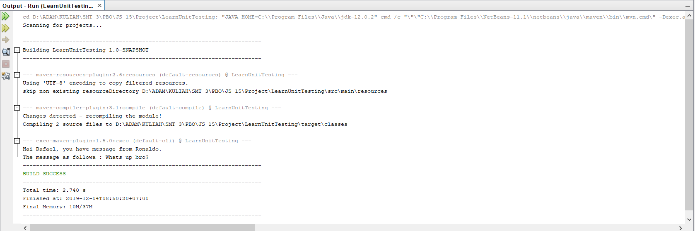

# Jobsheet Minggu ke-15 Unit Testing 

## Kompetensi
1. Memahami konsep dan fungsi unit testing 
2. Menerapkan unit testing dengan JUnit pada program sederhana. 
3. Menerapkan unit testing dengan JUnit pada progam yang terkoneksi database

## Percobaan 1: Dasar Unit Testing 
1. Buatlah sebuah project baru di NetBeans dengan nama LearnUnitTesting. Pada package unittest, di tempat yang sama dengan class mainnya, buatlah 1 file class baru bernama MessageProcessor.java. 
2. Bukalah file MessageProcessor.java, ketikkan baris-baris kode berikut yang terdiri dari beberapa properties. Setelah itu generate-lah setter untuk semua variabel-nya. 
3. Berikutnya, tambahkan 3 method berikut pada class MessageProcessor, pastikan semua access modifier-nya public. 
4. Berikutnya bukalah file class LearnUnitTesting.java yang telah dibuat pada langkah ke-1. Pada class tersebut tambahkan kode untuk menjalankan class MessageProcessor seperti berikut.

5. Eksekusi program seperti biasa lewat NetBeans untuk melihat jalannya program MessageProcessor yang telah Anda buat. 

6. Sampai disini, aplikasi telah selesai dibuat. Berikutnya akan kita buat pengetesan unit sederhana untuk program kita tersebut. Untuk melakukannya, pertama kali buatlah sebuah package bernama unittesting (sama dengan nama package project), di folder Test Packages. Pada package tersebut, tambahkan 2 buah file class bernama MessageProcessorTest.java dan TestRunner.java. Perhatikan penamaan class testing disini! Untuk menamai class untuk pengetesan maka konvensinya adalah NamaClass + Test = NamaClassTest. 
7. Pertama-tama bukalah terlebih dahulu file class MessageProcessorTest.java pada class tersebut tambahkan baris-baris kode berikut

8. Berikutnya tambahkan kode berikut pada method uji testShowMessage(). Kode pada method tersebut alurnya hampir sama dengan method pada langkah sebelumnya yaitu membandingkan ‘hasil yang diharapkan’, yang diisi manual berdasarkan nilai properti pesan dari objek mProcessor yang diisikan pada konstruktor, dengan hasil aktual dari method messageFormat() pada objek tersebut.
9. Kemudian bukalah file class TestRunner.java yang telah dibuat sebelumya, lalu isikan didalamnya baris-baris kode berikut.

10. Klik kanan pada file class tersebut lalu pilih Run. Maka pada output window akan dapat dilihat hasil seperti berikut.

11. Hasil unit testing juga dapat dilihat melalui Test Results Window jika kita menjalankan unit testing lewat menu Run  Test Project (Nama Project). Pada window ini akan ditampilkan bar warna hijau jika semua tes berhasil dijalankan, dan akan menampilkan warna merah jika sebaliknya. Disamping bar juga ditampilkan pesan-pesan yang kita kirim lewat System.out.println(). 

## Kesimpulan
nb : Mohon maaf pak sebelumnya. Sebetulnya jjoobsheet ini sudah ada di laptop saya sebelmnya pak. Karena ada kendala kemarin saat project an, laptop saya full install ulang pak. Dan saya tidak menyadari, bahwa jobsheet 15 yang sebelumnya sudah saya commit, ternyata belum sukses dan tidak ter commit pak. Jadi pada joobsheet ini saya mengerjakan kembali mulai dari 0 pak. Dan joobsheet sebelumnya juga lupa saya backup pak.

## Pernyataan Diri

Saya menyatakan isi tugas, kode program, dan laporan praktikum ini dibuat oleh saya sendiri. Saya tidak melakukan plagiasi, kecurangan, menyalin/menggandakan milik orang lain.

Jika saya melakukan plagiasi, kecurangan, atau melanggar hak kekayaan intelektual, saya siap untuk mendapat sanksi atau hukuman sesuai peraturan perundang-undangan yang berlaku.

Ttd,

***(Mochammad Adam's Arzaqi)***