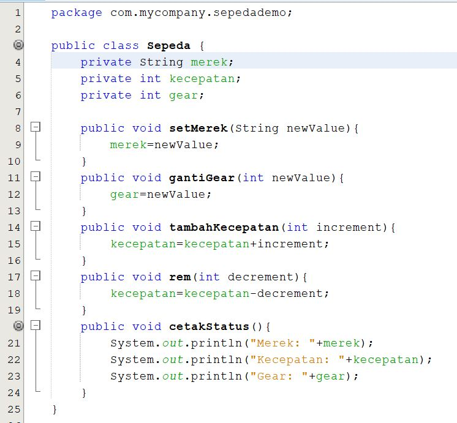
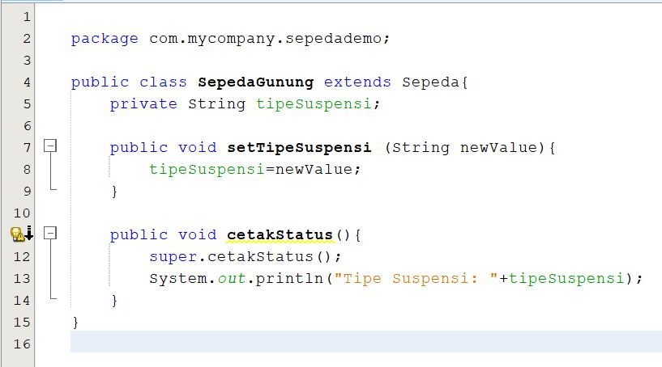
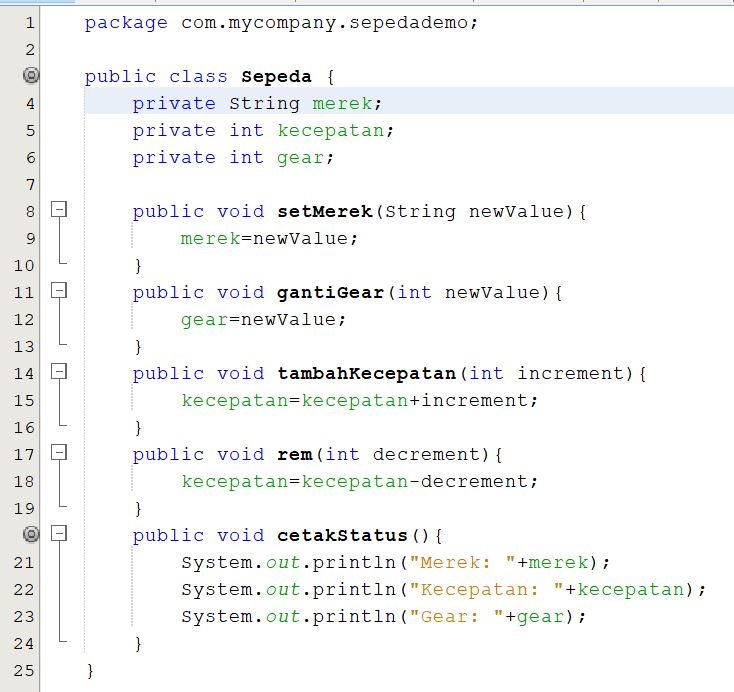
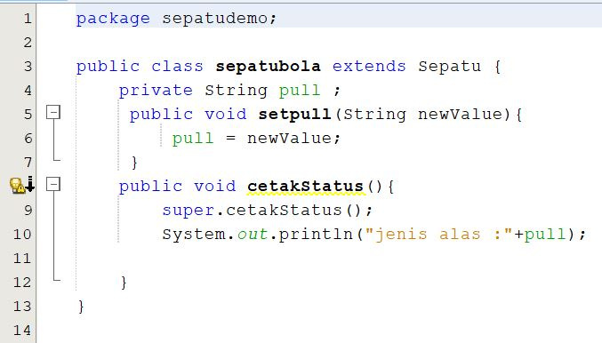
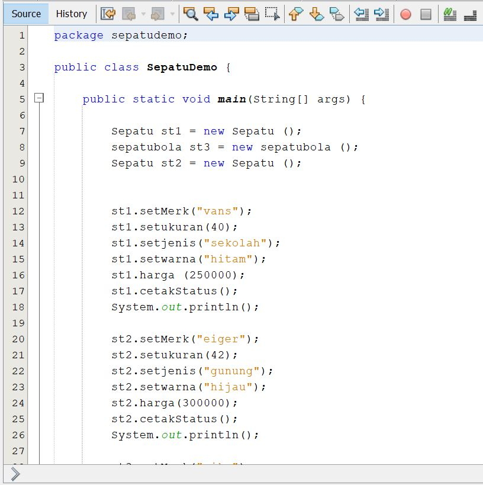
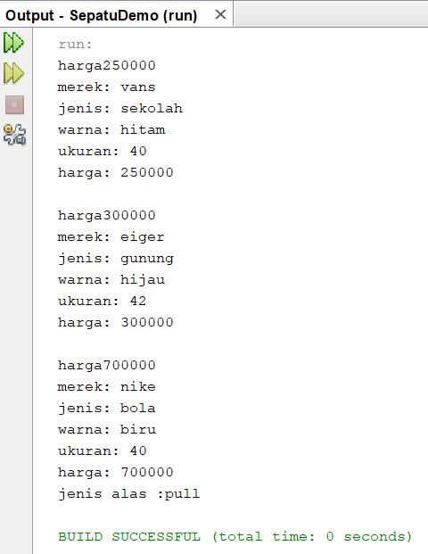

# Laporan Praktikum #1 - Pengantar Konsep PBO

## Kompetensi

Mampu mengenal: 
1. Perbedaan paradigma berorientasi objek dengan paradigma struktural
2. Konsep dasar PBO

## Ringkasan Materi

Pada dasarnya masih sama dengan semester sebelumnya yan saya pelajari. Namun, pada materi
kali ini materi nya menurut saya lebih ke merapikan sebuah code. Dan mengenal beberapa
aturan-aturan atau cara baru.

## Percobaan

### Percobaan 1

PERCOBAAN 1.

Sepeda.class

Contoh link kode program : [Sepeda](../../src/1_Pengantar_Konsep_PBO/Sepeda.java)

### Percobaan 2

PERCOBAAN 2

SepedaGunung.java

Contoh link kode program : [Sepeda Gunung](../../src/1_Pengantar_Konsep_PBO/SepedaGunung.java)

## Pertanyaan

1.	Sebutkan dan jelaskan aspek-aspek yang ada pada pemrograman berorientasi objek! 
Jawab : 
•	Object 
Object adalah suatu rangkaian dalam program yang terdiri dari state dan behaviour. Object pada software dimodelkan sedemikian rupa sehingga mirip dengan objek yang ada di dunia nyata.
•	Class 
Class adalah blueprint atau prototype dari objek.
•	Enkapsulasi
Dalam berinteraksi dengan objek, seringkali kita tidak perlu mengetahui kompleksitas yang ada didalamnya.
•	Inheritance
Disebut juga pewarisan. Inheritance memungkinkan kita untuk mengorganisir struktur program dengan natural.
•	Polimorfisme 
Polimorfisme juga meniru sifat objek di dunia nyata, dimana sebuah objek dapat memiliki bentuk, atau menjelma menjadi bentuk-bentuk lain.

2.	Apa yang dimaksud dengan object dan apa bedanya dengan class? 
Jawab : 
Object yaitu Object adalah suatu rangkaian dalam program yang terdiri dari state dan behavior,sedangkan class adalah blueprint atau prototype dari objek.

3.	Sebutkan salah satu kelebihan utama dari pemrograman berorientasi objek dibandingkan dengan pemrograman struktural!
Jawab : 
Kelebihan PBO adalah program dapat lebih fleksibel dan modular, jika ada perubahan fitur, maka dapat dipastikan keseluruhan program tidak akan terganggu. Berbeda dengan struktural, perubahan sedikit fitur saja kemungkinan dapat mengganggu keseluruhan program.  

4.	Pada class Sepeda, terdapat state/atribut apa saja?
Jawab : 
Kecepatan,gear,merek

## Tugas

TUGAS!!!`

Contoh link kode program : [Sepatu](../../src/1_Pengantar_Konsep_PBO/Sepatu.java)

## Kesimpulan

(Berisi simpulan yang telah diperoleh selama praktikum atau belajar pada pertemuan ini)

## Pernyataan Diri

Saya menyatakan isi tugas, kode program, dan laporan praktikum ini dibuat oleh saya sendiri. Saya tidak melakukan plagiasi, kecurangan, menyalin/menggandakan milik orang lain.

Jika saya melakukan plagiasi, kecurangan, atau melanggar hak kekayaan intelektual, saya siap untuk mendapat sanksi atau hukuman sesuai peraturan perundang-undangan yang berlaku.

Ttd,

***(Mochammad Adam's Arzaqi)***
