# Laporan Praktikum #2 - Class Dan Object

## Kompetensi

- Mahasiswa dapat memahami deskripsi dari class dan object
- Mahasiswa memahami implementasi dari class
- Mahasiswa dapat memahami implementasi dari attribute
- Mahasiswa dapat memahami implementasi dari method
- Mahasiswa dapat memahami implementasi dari proses instansiasi
- Mahasiswa dapat memahami implementasi dari try-catch
- Mahasiswa dapat memahami proses pemodelan class diagram menggunakan UML 

## Ringkasan Materi

Pemahaman Pada materi kali ini, saya lebiih ter-jelaskan lagi untuk memfungsikan sebuah fungsi dan method-method-nya.

## Percobaan

## Percobaan 1: Membuat Class Diagram 

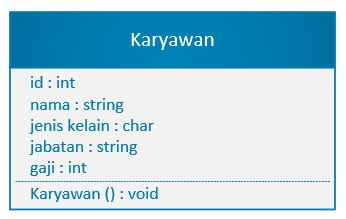

### 4.2 Percobaan 2

Membuat dan mengakses anggota suatu class.

1. Bukalah text editor atau IDE, misalnya Notepad ++ / netbeans. 
2. Ketikkan kode program berikut ini: 
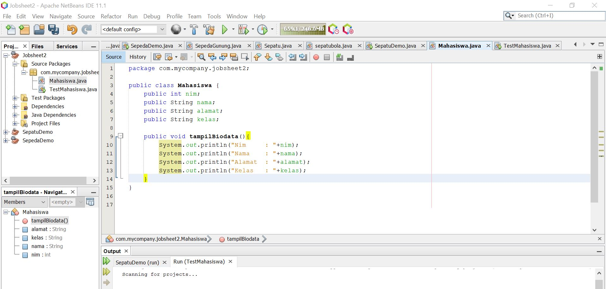

Link kode program : [MAHASISWA](../../src/2_Class_dan_Object/Mahasiswa.java)

3. Simpan dengan nama file Mahasiswa.java. 
4. Untuk dapat mengakses anggota-anggota dari suatu obyek, maka harus dibuat instance dari class tersebut terlebih dahulu. Berikut ini adalah cara pengaksesan anggota- anggota dari class Mahasiswa dengan membuka file baru kemudian ketikkan kode program berikut:
 

Link kode program : [TEST MAHASISWA](../../src/2_Class_dan_Object/TestMahasiswa.java)

5. Simpan file dengan TestMahasiswa.java 
6. Jalankan class TestMahasiswa
7. Jelaskan pada bagian mana proses pendeklarasian atribut pada program diatas! 
    JAWAB : Pada clas mahasiswa dari  line 2 sampai dengan line 5
8. Jelaskan pada bagian mana proses pendeklarasian method pada program diatas! 
    JAWAB : pada class mahasiswa pada line ke 7
9. Berapa banyak objek yang di instansiasi pada program diatas! 
    JAWAB : satu ,  pada class  testMahasiswa
10. Apakah yang sebenarnya dilakukan pada sintaks program “mhs1.nim=101” ? 
    JAWAB : menampilkan pada objek
11. Apakah yang sebenarnya dilakukan pada sintaks program “mhs1.tampilBiodata()” ? 
    JAWAB : untuk  menampilkan output yang  dihasilkan
12. Instansiasi 2 objek lagi pada program diatas!
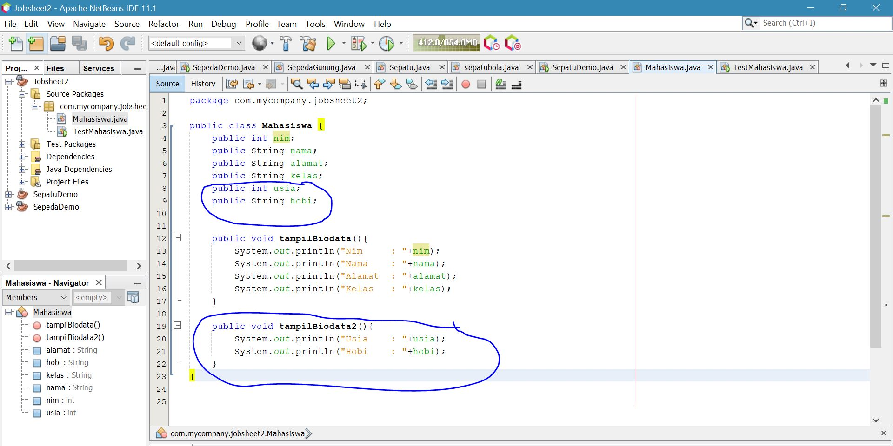
Link kode program : [MAHASISWA](../../src/2_Class_dan_Object/Mahasiswa.java)

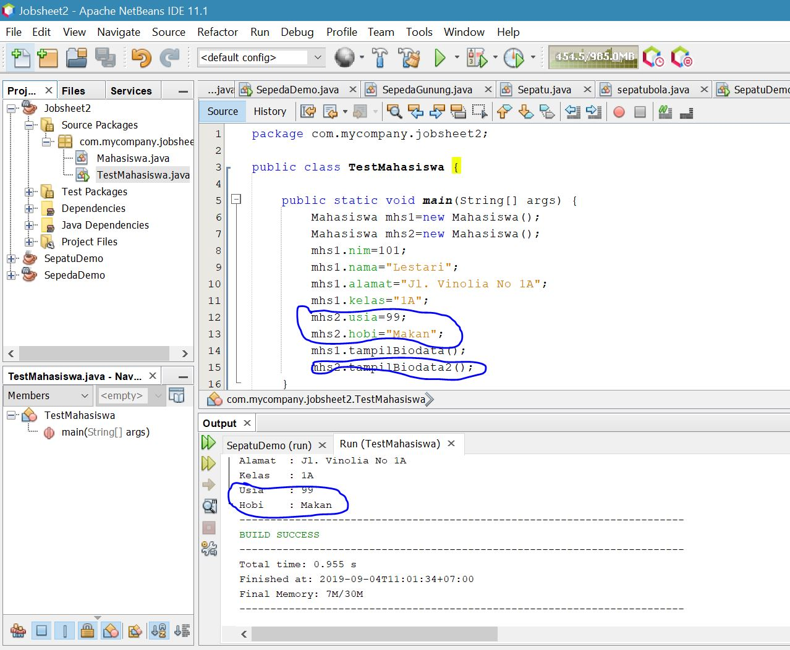
Link kode program : [TEST MAHASISWA](../../src/2_Class_dan_Object/TestMahasiswa.java)

## Percobaan 3: Menulis method yang memiliki argument/parameter dan memiliki return 

1. Bukalah text editor atau IDE, misalnya Notepad ++ / netbeans.
2. Ketikkan kode program berikut ini: 
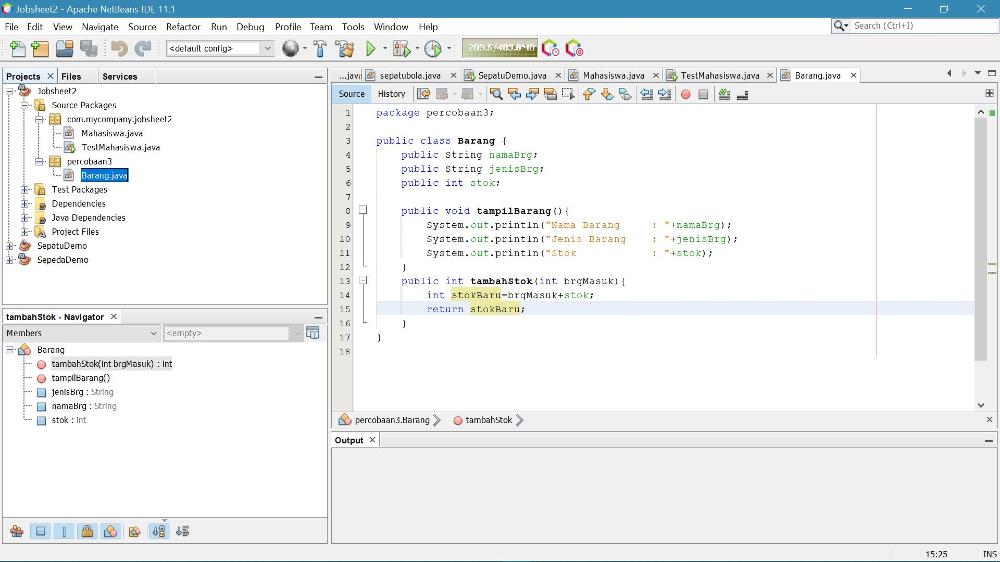
Link kode program : [BARANG](../../src/2_Class_dan_Object/Barang.java)
3. Simpan dengan nama file Barang.java
4. Untuk dapat mengakses anggota-anggota dari suatu obyek, maka harus dibuat instance dari class tersebut terlebih dahulu. Berikut ini adalah cara pengaksesan anggota- anggota dari class Barang dengan membuka file baru kemudian ketikkan kode program berikut: 
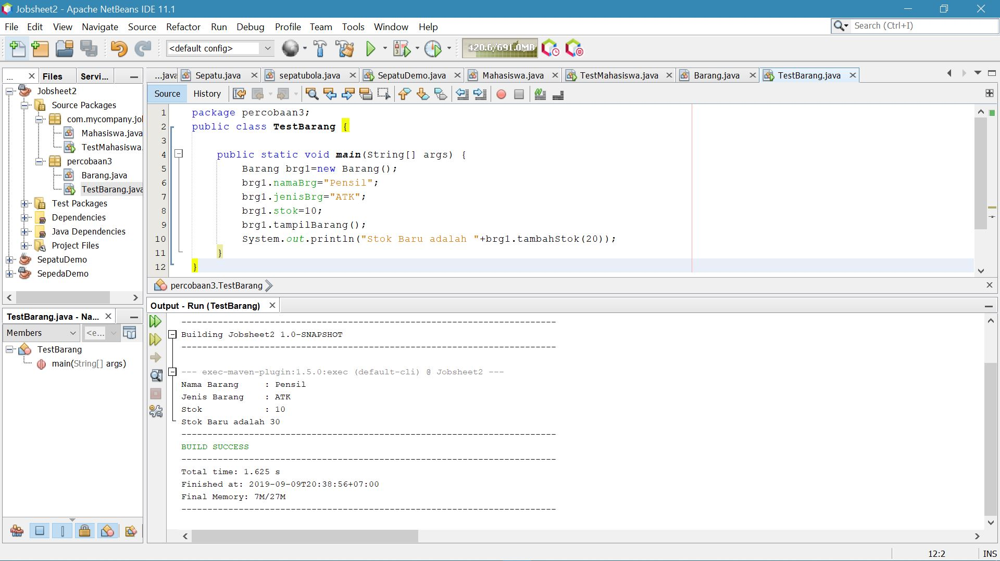
Link kode program : [BARANG](../../src/2_Class_dan_Object/TestBarang.java)
5. Simpan dengan nama file TestBarang.java
6. Jalankan program tersebut!
7. Apakah fungsi argumen dalam suatu method?
8. Ambil kesimpulan tentang kegunaan dari kata kunci return , dan kapan suatu method harus memiliki return!

## TUGAS

1. Suatu toko persewaan video game salah satu yang diolah adalah peminjaman, dimana data yang dicatat ketika ada orang yang melakukan peminjaman adalah id, nama member, nama game, dan harga yang harus dibayar. Setiap peminjaman bisa menampilkan data hasil peminjaman dan harga yang harus dibayar. Buatlah class diagram pada studi kasus diatas! 

Penjelasan: 
-Harga yang harus dibayar diperoleh dari lama sewa x harga. 
-Diasumsikan 1x transaksi peminjaman game yang dipinjam hanya 1 game saja.

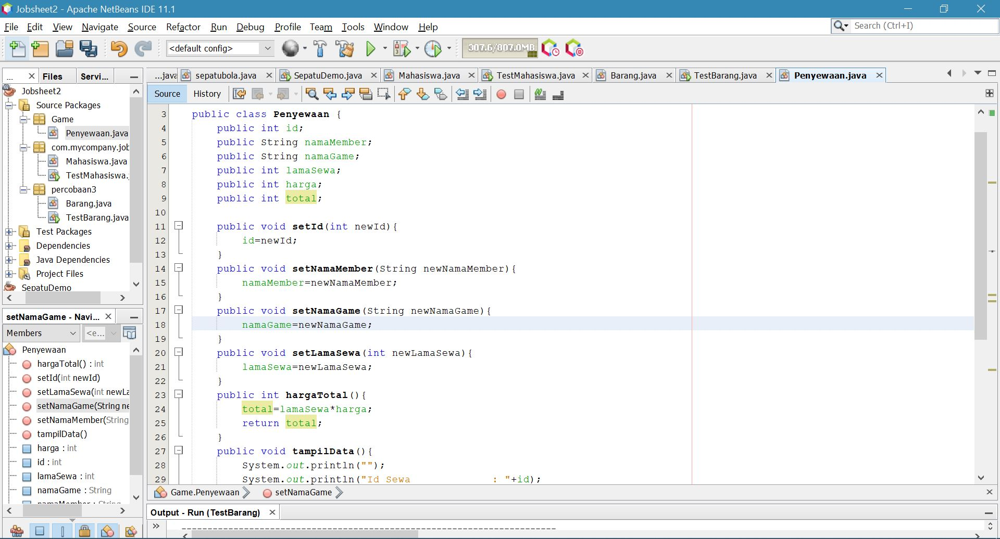
Link kode program : [PENYEWAAN](../../src/2_Class_dan_Object/Penyewaan.java)
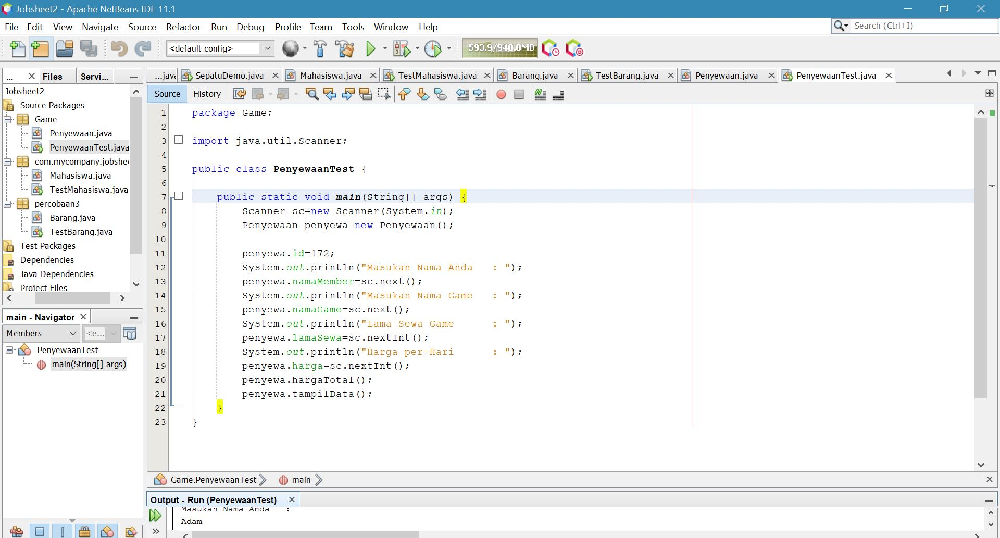
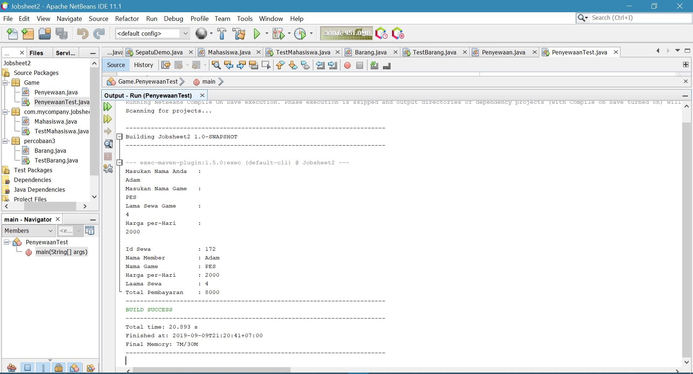
Link kode program : [PENYEWAAN](../../src/2_Class_dan_Object/PenyewaanTest.java)

2. Buatlah program dari class diagram yang sudah anda buat di no 1! 

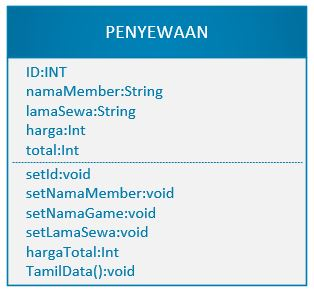

3. Buatlah program sesuai dengan class diagram berikut ini: 

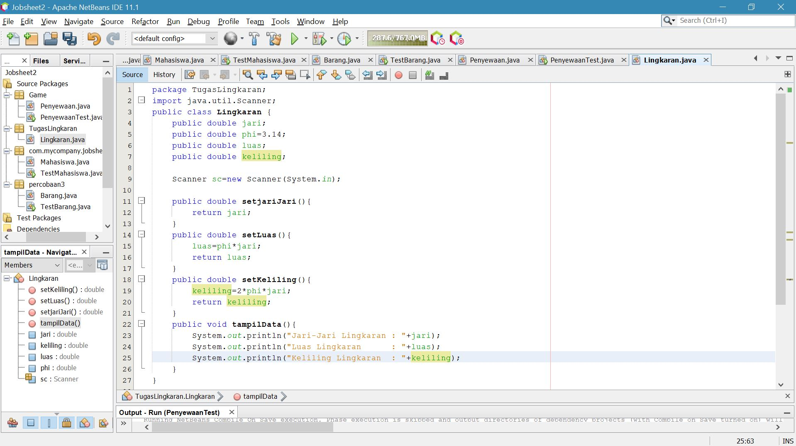

Link kode program : [LINGKARAN](../../src/2_Class_dan_Object/Lingkaran.java)

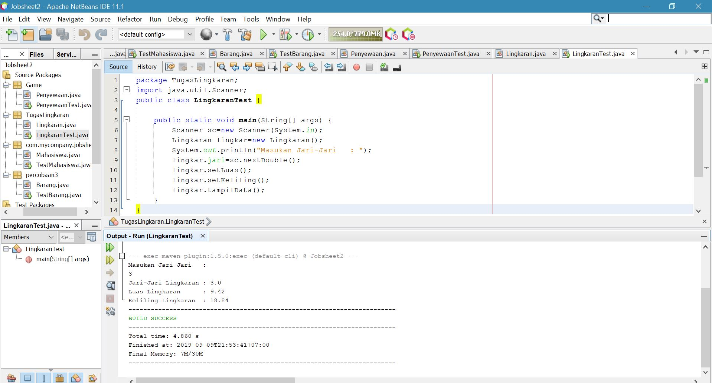

Link kode program : [LINGKARAN](../../src/2_Class_dan_Object/LingkaranTest.java)

4. Buatlah program sesuai dengan class diagram berikut ini: 

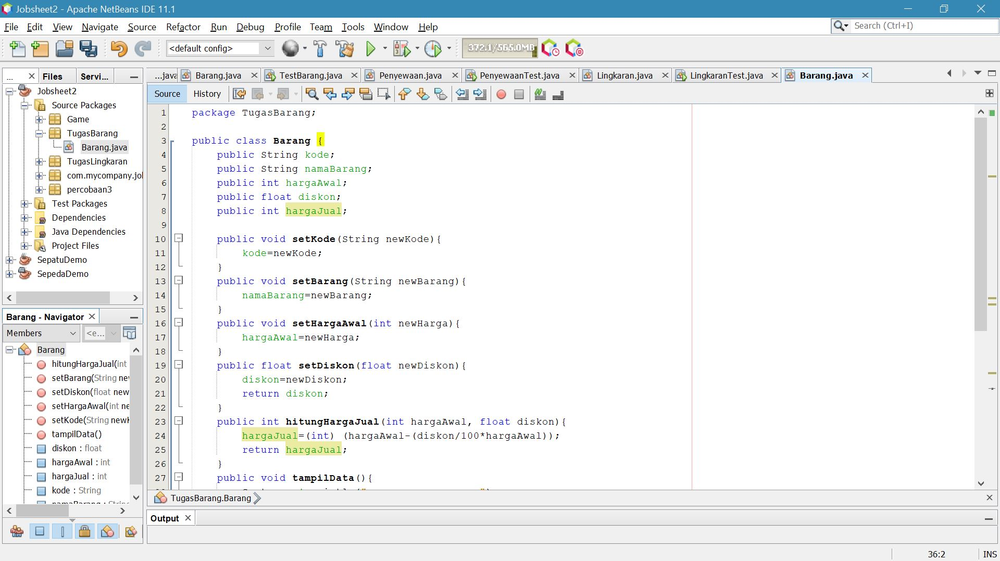

Link kode program : [TUGAS4](../../src/2_Class_dan_Object/Barang1.java)

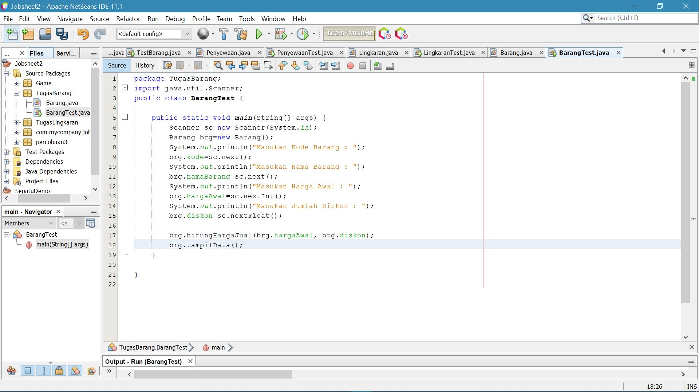
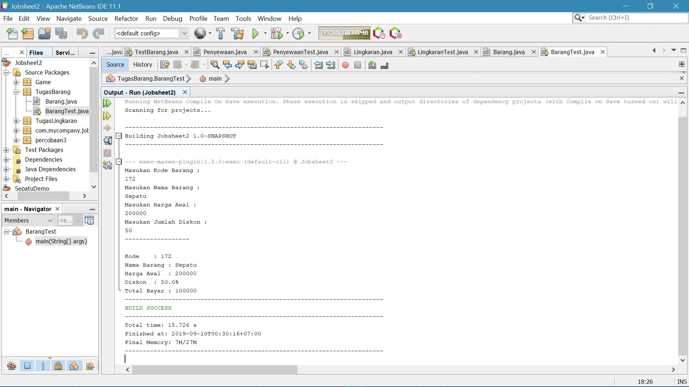

Link kode program : [TUGAS4](../../src/2_Class_dan_Object/BarangTest.java)

## Pernyataan Diri

Saya menyatakan isi tugas, kode program, dan laporan praktikum ini dibuat oleh saya sendiri. Saya tidak melakukan plagiasi, kecurangan, menyalin/menggandakan milik orang lain.

Jika saya melakukan plagiasi, kecurangan, atau melanggar hak kekayaan intelektual, saya siap untuk mendapat sanksi atau hukuman sesuai peraturan perundang-undangan yang berlaku.

Ttd,

***(Mochammad Adam's Arzaqi)***
