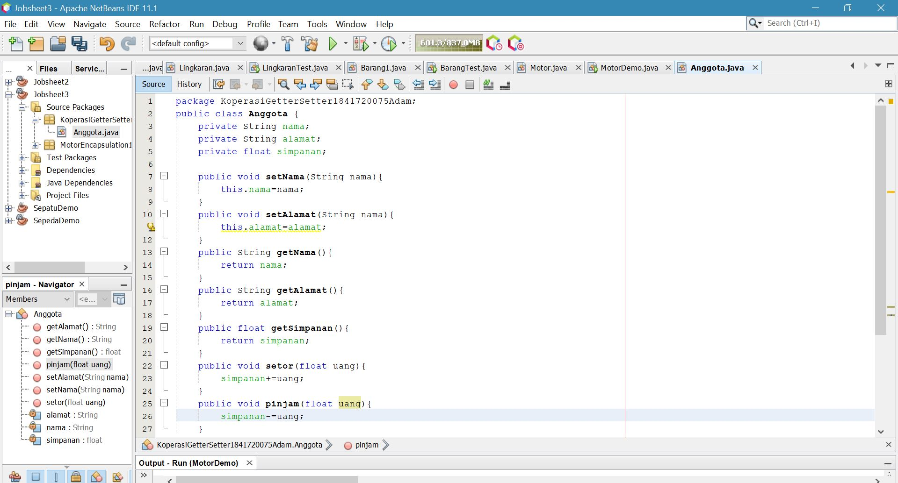
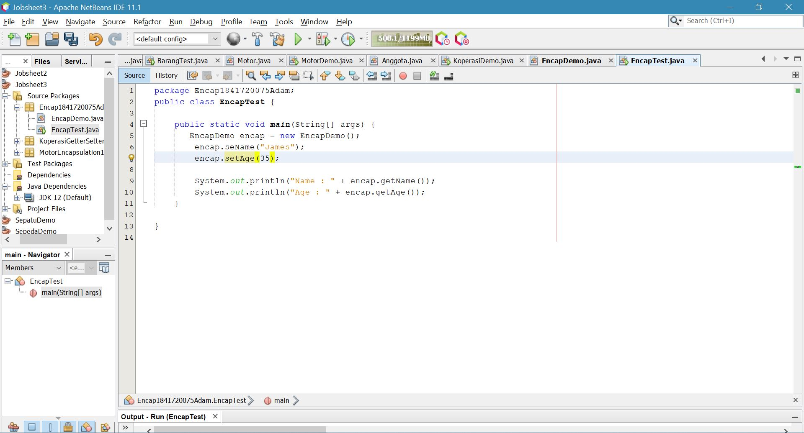

# Laporan Praktikum #3 - Enkapsulasi Pada Pemrograman Berorientasi Objek 

## Kompetensi

Setelah melakukan percobaan pada modul ini, mahasiswa memahami konsep: 
1. Konstruktor 
2. Akses Modifier 
3. Atribut/method pada class 
4. Intansiasi atribut/method  
5. Setter dan getter 
6. Memahami notasi pada UML Class Diagram 

## Ringkasan Materi

Dari percobaan diatas, telah dipelajari kosep dari enkapsulasi, kontruktor, access modifier yang terdiri dari 4 jenis yaitu public, protected, default dan private. Konsep atribut atau method class yang ada di dalam blok code class dan konsep instansiasi atribut atau method. Cara penggunaan getter dan setter beserta fungsi dari getter dan setter. Dan juga telah dipelajari atau memahami notasi UML

## 3.1 Percobaan 1 - Enkapsulasi 

Didalam percobaan enkapsulasi, buatlah class Motor yang memiliki atribut kecepatan dan kontakOn, dan memiliki method printStatus() untuk menampilkan status motor. Seperti berikut :

1. Buka Netbeans, buat project MotorEncapsulation.
2. Buat class Motor. Klik kanan pada package motorencapsulation – New – Java Class.
3. Ketikkan kode class Motor dibawah ini

Link kode program : [ENKAPSULASI](../../src/3_Enkapsulasi/Motor.java)

bentuk UML class diagram class Motor adalah sebagai berikut: 

4. Kemudian buat class MotorDemo, ketikkan kode berikut ini:

5. Hasilnya adalah sebagai berikut: 

Link kode program : [ENKAPSULASI](../../src/3_Enkapsulasi/MotorDemo.java)

## 3.2 Percobaan 2 - Access Modifier 

Pada percobaan ini akan digunakan access modifier untuk memperbaiki cara kerja class Motor pada percobaan ke-1. 

1. Ubah cara kerja class motor sesuai dengan UML class diagram berikut

2. Berdasarkan UML class diagram tersebut maka class Motor terdapat perubahan, yaitu:
 
 a. Ubah access modifier kecepatan dan kontakOn menjadi private 
b. Tambahkan method nyalakanMesin, matikanMesin, tambahKecepatan, kurangiKecepatan.

Implementasi class Motor adalah sebagai berikut: 

Link kode program : [ENKAPSULASI](../../src/3_Enkapsulasi/Motor.java)

3. Kemudian pada class MotorDemo, ubah code menjadi seperti berikut: 

4. Hasilnya dari class MotorDemo adalah sebagai berikut:

Link kode program : [ENKAPSULASI](../../src/3_Enkapsulasi/MotorDemo.java)

## 3.3 Pertanyaan
1. Pada class TestMobil, saat kita menambah kecepatan untuk pertama kalinya, mengapa muncul peringatan “Kecepatan tidak bisa bertambah karena Mesin Off!”?

JAWAB: Karena pada program nya dituliskan seperti itu

2. Mengapat atribut kecepatan dan kontakOn diset private?

JAWAB: Termasuk jenis enkapsulasi, agar di dalam class main atau class lainya attribute kecepatan dan kontakon dalam class Motor tidak dapat diakses secara sembarangan dan diganti nilainya.

3. Ubah class Motor sehingga kecepatan maksimalnya adalah 100!

JAWAB: 

## 3.4 Percobaan 3 -  Getter dan Setter 

Misalkan di sebuah sistem informasi koperasi, terdapat class Anggota. Anggota memiliki atribut nama, alamat dan simpanan, dan method setter, getter dan setor dan pinjam. Semua atribut pada anggota tidak boleh diubah sembarangan, melainkan hanya dapat diubah melalui method setter, getter, setor dan tarik. Khusus untuk atribut simpanan tidak terdapat setter karena simpanan akan bertambah ketika melakukan transaksi setor dan akan berkurang ketika melakukan peminjaman/tarik. 
1. Berikut ini UML class buatlah class Mahasiswa pada program: 
 

2. Sama dengan percobaan 1 untuk membuat project baru
 
a . Buka Netbeans, buat project KoperasiGetterSetter.
 
b . Buat class Anggota. Klik kanan pada package koperasigettersetter – New – Java Class.
 
c . Ketikkan kode class Anggota dibawah ini.

Link kode program : [ENKAPSULASI](../../src/3_Enkapsulasi/Anggota.java)

3. Selanjutnya buatlah class KoperasiDemo untuk mencoba class Anggota

Link kode program : [ENKAPSULASI](../../src/3_Enkapsulasi/KoperasiDemo.java)

## 3.5 Percobaan 4 -  Konstruktor, Instansiasi

1. Langkah pertama percobaan 4 adalah ubah class KoperasiDemo seperti berikut 

2. Hasil dari program tersebut adalah sebagai berikut

3. Ubah class Anggota menjadi seperti berikut

4. Selanjutnya ubah class KoperasiDemo sebagai berikut

5. Hasil dari program tersebut adalah sebagai berikut

## 3.6 Pertanyaan – Percobaan 3 dan 4

1. Apa yang dimaksud getter dan setter?

JAWABAN: Sepenangkapan saya getter dan setter adalah  method yang digunakan sebagai serangkaian dari enkapsulasi, dimana attribute pada class tersebut di dinyatakan sebagai attribute private, namun nilai dari attribute tersebut dapat diubah atau dilihat secara tidak langsung dengan method getter dan setter, tujuannya dalah untuk meningkatakan keamanan dari project tersebut, agar attribute class tersebut tidak dapat di akses secara bebas di class lain.

2. Apa kegunaan dari method getSimpanan()?

JAWABAN: Ketika method tersebut dipanggil di dalam class lain maka akan mengembalikan nilai dari attribute private simpanan. Secara gambling, untuk menampilkan nilai dari attribute simpanan.

3. Method apa yang digunakan untk menambah saldo?

JAWABAN: Method setor digunakan menambahkan jumlah simpanan, dimana parameter dari method setor adalah inputan dari user yang akan ditambah ke dalam attribute seimpanan.

4. Apa yand dimaksud konstruktor?

JAWABAN: Konsktruktor adalah method yang pertama kali dijalankan pada saat sebuah objek pertama kali diciptakan, konstruktor biasanya digunakan untuk menginisialisasi atau memberikan nilai  (melalui parameter) kepada sebuah objek pada saat objek pertama kali diciptakan.

5. Sebutkan aturan dalam membuat konstruktor?

JAWABAN: Sesuai dengan modul aturannya adalah
- Nama konstruktor harus sama dengan nama class
- Konstruktor tidak memiliki tipe data return
- onstruktor tidak boleh menggunakan modifier abstract, static, final, dan syncronized

6. Apakah boleh konstruktor bertipe private?

JAWABAN: Boleh, namun konstruktor tersebut tidak bisa diakses di class lain.

7. Kapan menggunakan parameter dengan passsing parameter?

JAWABAN: Ketika parameter konstruktor tidak di deskripsikan kosong, saat konstruktor berisi parameter yang harus dipenuhi, maka harus dilakukan passing parameter untuk menggunakan konstruktor tersebut. Dan ketika kita tidak menggunakan getter dan setter.

8. Apa perbedaan atribut class dan instansiasi atribut?

JAWABAN: 

9. Apa perbedaan class method dan instansiasi method?

JAWABAN:

##  Tugas 

1. Cobalah program dibawah ini dan tuliskan hasil outputnya 

Link kode program : [ENKAPSULASI](../../src/3_Enkapsulasi/EncapDemo.java)

Link kode program : [ENKAPSULASI](../../src/3_Enkapsulasi/EncapTest.java)

2. Pada program diatas, pada class EncapTest kita mengeset age dengan nilai 35, namun pada saat ditampilkan ke layar nilainya 30, jelaskan mengapa. 

JAWABAN :

3. Ubah program diatas agar atribut age dapat diberi nilai maksimal 30 dan minimal 18. 

4. Pada sebuah sistem informasi koperasi simpan pinjam, terdapat class Anggota yang memiliki atribut antara lain nomor KTP, nama, limit peminjaman, dan jumlah pinjaman. Anggota dapat meminjam uang dengan batas limit peminjaman yang ditentukan. Anggota juga dapat mengangsur pinjaman. Ketika Anggota tersebut mengangsur pinjaman, maka jumlah pinjaman akan berkurang sesuai dengan nominal yang diangsur. Buatlah class Anggota tersebut, berikan atribut, method dan konstruktor sesuai dengan kebutuhan. Uji dengan TestKoperasi berikut ini untuk memeriksa apakah class Anggota yang anda buat telah sesuai dengan yang diharapkan. 

Link kode program : [ENKAPSULASI](../../src/3_Enkapsulasi/AnggotaKoperasi.java)

Link kode program : [ENKAPSULASI](../../src/3_Enkapsulasi/TestKoperasi.java)

5. Modifikasi soal no. 4 agar nominal yang dapat diangsur minimal adalah 10% dari jumlah pinjaman saat ini. Jika mengangsur kurang dari itu, maka muncul peringatan “Maaf, angsuran harus 10% dari jumlah pinjaman”.

Link kode program : [ENKAPSULASI](../../src/3_Enkapsulasi/AnggotaKoperasi.java)

Link kode program : [ENKAPSULASI](../../src/3_Enkapsulasi/TestKoperasi.java)

6. Modifikasi class TestKoperasi, agar jumlah pinjaman dan angsuran dapat menerima input dari console

Link kode program : [ENKAPSULASI](../../src/3_Enkapsulasi/AnggotaKoperasi.java)

Link kode program : [ENKAPSULASI](../../src/3_Enkapsulasi/TestKoperasi.java)