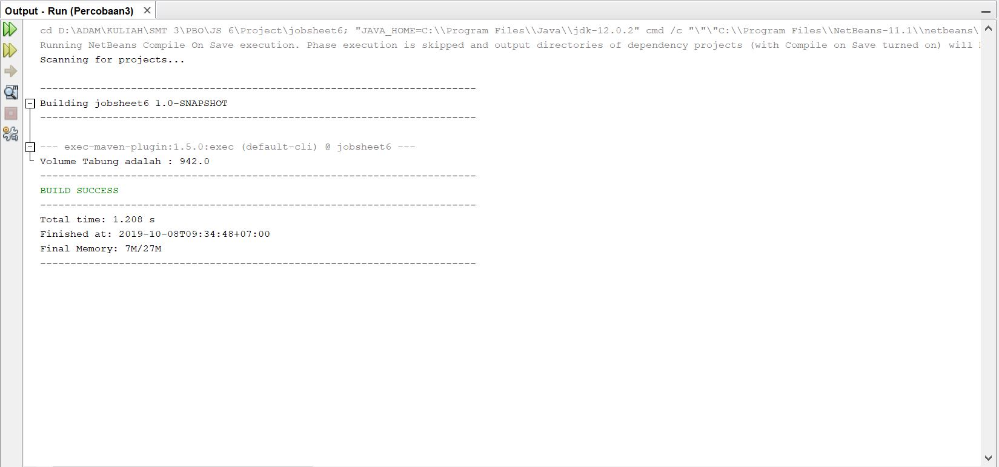
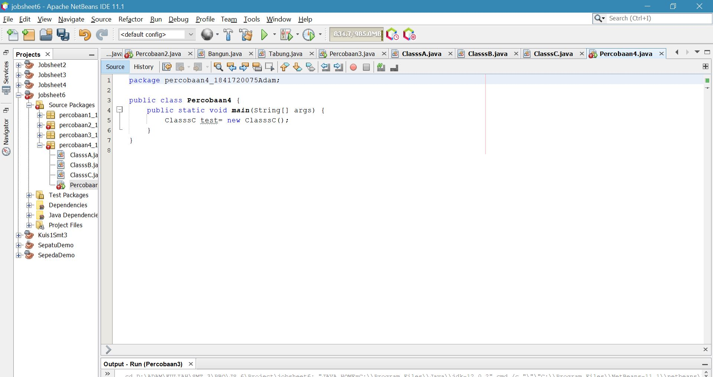

# Laporan Praktikum #6 - Inheritance

## Kompetensi

1. Memahami konsep dasar inheritance atau pewarisan.	
2. Mampu membuat suatu subclass dari suatu superclass tertentu.	
3. Mampu mengimplementasikan konsep single dan multilevel inheritance.	 

## Ringkasan Materi

Inheritance atau pewarisan sifat merupakan suatu cara untuk menurunkan suatu class yang lebih umum menjadi suatu class yang lebih spesifik.Inheritance adalah salah satu ciri utama suatu bahasa program yang berorientasi pada objek.Inti dari pewarisan adalah sifat reusable dari konsep object oriented.Setiap subclass akan “mewarisi” sifat dari	superclass selama bersifat protected ataupun public.	
   
# Percobaan

## Percobaan 1

(pada percobaan ini, kita mendemonstrasikan extends)

Link Kode Program : 
[INHERITANCE](../../src/6_Inheritance/ClasA.java)

Link Kode Program : [RELASI](../../src/6_Inheritance/ClasB.java)

Link Kode Program : [INHERITANCE](../../src/6_Inheritance/Percobaan1.java)

### Pertanyaan Percobaan 1
1. Pada percobaan 1 diatas program yang dijalankan terjadi error, kemudian perbaiki sehingga program tersebut bias dijalankan dan tidak error!

    Jawab : Karena pada class tidak di extends kan

2. Jelaskan apa penyebab program pada percobaan 1 ketika dijalankan terdapat error!

        Jawab : karena tidak ada relasi antar class sehingga ketika atribut di panggil menghasilkan eror

## Percobaan 2

(Pada percobaan 2 kita mendemonstrasikan bagaimana melakukan hak akses )

Link Kode Program : [INHERITANCE](../../src/6_Inheritance/ClassA.java)

Link Kode Program : [INHERITANCE](../../src/6_Inheritance/ClassB.java)

Link Kode Program : [INHERITANCE](../../src/6_Inheritance/Percobaan2.java)

### Pertanyaan Percobaan 2
1. Pada percobaan 2 diatas program yang dijalankan terjadi error, kemudian perbaiki sehingga program tersebut bisa dijalankan dan tidak error!

Jawab : 

2. Jelaskan apa penyebab program pada percobaan 1 ketika dijalankan terdapat error!	 

        Jawab : karena atribut x dan y bersifat private sehingga tidak dapat di akses oleh subclass nya  

## Percobaan 3
(Pada percobaan 3 kita mendemonstrasikan bagaimana menggunakan super)

Link Kode Program : [INHERITANCE](../../src/6_Inheritance/Bangun.java)

Link Kode Program : [INHERITANCE](../../src/6_Inheritance/Tabung.java)

Link Kode Program : [INHERITANCE](../../src/6_Inheritance/Percobaan3.java)

### Pertanyaan Percobaan 3
1.	Jelaskan fungsi “super” pada potongan program berikut di class Tabung! 
        
        Jawab : Untuk mempresentasikan objek dari suatu kelas.

2.	Jelaskan fungsi “super” dan “this” pada potongan program berikut di class Tabung! 

        Jawab : Fungsinya untuk mengambil nilai dari kelas induk , sedangkan This untuk mempresentasikan object class itu sendiri. 

3.	Jelaskan mengapa pada class Tabung tidak dideklarasikan atribut “phi” dan “r” tetapi class tersebut dapat mengakses atribut tersebut! 

        Jawab : Karena kelas Tabung mengambil nilai objek dari kelas Bangun.

## Percobaan 4
(Pada percobaan 4 kita mendemonstrasikan bagaimana menggunakan super konstruktor)

Link Kode Program : [INHERITANCE](../../src/6_Inheritance/ClasssA.java)

Link Kode Program : [INHERITANCE](../../src/6_Inheritance/ClasssB.java)

Link Kode Program : [INHERITANCE](../../src/6_Inheritance/ClasssC.java)

Link Kode Program : [INHERITANCE](../../src/6_Inheritance/Percobaan4.java)

### Pertanyaan Percobaan 4
1.	Pada percobaan 4 sebutkan mana class yang termasuk superclass dan subclass, kemudian jelaskan alasannya!
        
        Jawab : 

        Karena pada classB dan classC kita mengetikkan extends untuk memanggil nilai dari induk class

2.	Ubahlah isi konstruktor default ClassC seperti berikut:	 Tambahkan kata super() di baris	 Pertaman dalam konstruktor defaultnya. Coba jalankan kembali class Percobaan4 dan terlihat tidak ada perbedaan dari hasil outputnya!	
Jawab : 

3.	Ublah isi konstruktor default ClassC seperti berikut:
Ketika mengubah posisi super() dibaris kedua dalam kontruktor defaultnya dan terlihat ada error. Kemudian kembalikan super() kebaris pertama seperti sebelumnya, maka errornya akan hilang. Perhatikan hasil keluaran ketika class Percobaan4 dijalankan. Kenapa bisa tampil output seperti berikut pada saat instansiasi objek test dari class ClassC :
Jelaskan bagaimana urutan proses jalannya konstruktor saat objek test dibuat!
Jawab : 

        Karena ketika memindah perintah super() kebawah dalam sebuah method, maka akan terjadi eror karna fungsi dari super() adalah untuk memanggil nilai dari super class nya

4.	Apakah fungsi super() pada potongan program dibawah ini di ClassC!

        Jawab : untuk memanggil method tertentu dari class induk

## Percobaan 5
(Pada percobaan 5 kita mendemonstrasikan bagaimana melakukan semua percobaan sebelumnya)

Link Kode Program : [INHERITANCE](../../src/6_Inheritance/Karyawan.java)

Link Kode Program : [INHERITANCE](../../src/6_Inheritance/Manager.java)

Link Kode Program : [INHERITANCE](../../src/6_Inheritance/Staff.java)

Link Kode Program : [INHERITANCE](../../src/6_Inheritance/Inheritance1.java)

### Pertanyaan Percobaan 5
1.	Sebutkan class mana yang termasuk super class dan sub class dari percobaan 1 diatas!

        Jawab : 
        Super Class : Keryawan
        Subclass : Staff, Manager
2.	Kata kunci apakah yang digunakan untuk menurunkan suatu class ke class yang lain?

        Jawab : Extends dan super()

3.	Perhatikan kode program pada class Manager, atribut apa saja yang dimiliki oleh class tersebut? Sebutkan atribut mana saja yang diwarisi dari class Karyawan!

        Jawab : atribut int tunjangan 
        Atribut pada class karyawan : Gaji, akan diturunkan pada atribut tujangan pada class manager

4.	Jelaskan kata kunci super pada potongan program dibawah ini yang terdapat pada class Manager!

        Jawab : untuk mewakili dari class intuk yaitu gaji, sedangkan tunjangan mewakili kelas manager

5.	Program pada percobaan 1 diatas termasuk dalam jenis inheritance apa? Jelaskan alasannya!

        Jawab : Multilevel inheritance, karena ada sub class yang menjadi induk dari class lainnya.	 

## Percobaan 6
(Pada percobaan 6 kita menambahkan class Staff Tetap dan Staff Harian)

Link Kode Program : [INHERITANCE](../../src/6_Inheritance/staffTetap.java)

Link Kode Program : [INHERITANCE](../../src/6_Inheritance/staffHarian.java)

Link Kode Program : [INHERITANCE](../../src/6_Inheritance/Inheritance11.java)

### Pertanyaan Percobaan 6
1.	Berdasarkan class diatas manakah yang termasuk single inheritance dan mana yang termasuk multilevel inheritance?

        Jawab : 
        Single inheritance : Pada percobaan pertama (classB mewakili classB, dan classTabung mewakili classTabung
        Multilevel inheritance : pada percobaan 4(classB mewakili classA, StaffTetap mewakili Staff)

2.	 Perhatikan kode program class StaffTetap dan StaffHarian, atribut apa saja yang dimiliki oleh class tersebut? Sebutkan atribut mana saja yang diwarisi dari class Staff!	

        Jawab : atribut class StaffHarian = jumlah jam kerja yang mana atribut ini diwarisi oleh class karyawan(potongan)
        Atribut classStaffTetap = jumlah jam kerja yang mana atribut ini diwarisi oleh class karyawan(potongan)

3.	Apakah fungsi potongan program berikut pada class StaffHarian?

        Jawab : untuk memanggil nilai dari variabel yang ada didalam class induk

4.	 Apakah fungsi potongan program berikut pada class StaffHarian?

        Jawab : pada method tampilDataStaff() menggunakan kata kunci super untuk memanggil nilai dari variabel yang ada di dalam subclass

5.	 Perhatikan kode program dibawah ini yang terdapat pada class StaffTetap
Terlihat dipotongan program diatas atribut gaji, lembur dan potongan dapat diakses langsung. Kenapa hal ini bisa terjadi dan bagaimana class StaffTetap memiliki atribu gaji, lembur, dan potongan padahal dalam class tersebut tidak dideklarasikan atribut gaji, lembur, dan potongan?

        Jawab : karena pada class StaffTetap menggunakan extends untuk memanggil isi yang terdapat didalam class Staff yang mana isinya atribut gaji, lembur, dan potongan

## Tugas

(Buatlah sebuah	program dengan konsep pewarisan	seperti pada class diagram berikut ini.Kemudian	buatlah instansiasi objek untuk menampilkan data pada classMac Windows dan Pc!)

Link Kode Program : [INHERITANCE](../../src/6_Inheritance/Komputer.java)

Link Kode Program : [INHERITANCE](../../src/6_Inheritance/Laptop.java)

Link Kode Program : [INHERITANCE](../../src/6_Inheritance/Pc.java)

Link Kode Program : [INHERITANCE](../../src/6_Inheritance/Mac.java)

Link Kode Program : [INHERITANCE](../../src/6_Inheritance/Windows.java)

Link Kode Program : [INHERITANCE](../../src/6_Inheritance/Tugas6.java)

## Kesimpulan

- Pada jobsheet 6, kami diajarkan untuk mengimplementasikan metode inheritance atau turunan antar class  

## Pernyataan Diri

Saya menyatakan isi tugas, kode program, dan laporan praktikum ini dibuat oleh saya sendiri. Saya tidak melakukan plagiasi, kecurangan, menyalin/menggandakan milik orang lain.

Jika saya melakukan plagiasi, kecurangan, atau melanggar hak kekayaan intelektual, saya siap untuk mendapat sanksi atau hukuman sesuai peraturan perundang-undangan yang berlaku.

Ttd,

***Mochammad Adam's Arzaqi***.
