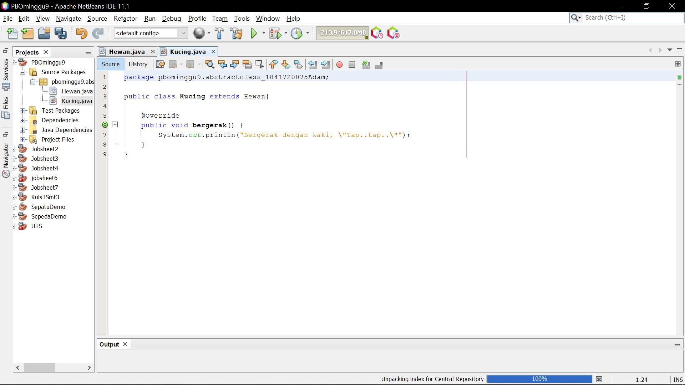

# Laporan Praktikum #7 - Overloading dan Overriding

## Kompetensi

Setelah menyelesaikan lembar kerja ini mahasiswa diharapkan mampu: 
 1. Menjelaskan maksud dan tujuan penggunaan Abstract Class; 
 2. Menjelaskan maksud dan tujuan penggunaan Interface; 
 3. Menerapkan Abstract Class dan Interface di dalam pembuatan program

## Ringkasan Materi

Abstract Class 
 Abstract Class adalah class yang tidak dapat diinstansiasi namun dapat di-extend. Abstract class baru dapat dimanfaatkan ketika ia di-extend.

# Percobaan 1: Abstract Class 

1. Buatlah sebuah project baru di NetBeans dengan nama PBOMinggu9 
2. Pada package pbominggu9, tambahkan package baru dengan cara klik kanan nama package - New - Java Package… 
3. Beri nama package tersebut dengan nama abstractclass. Semua class yang dibuat pada percobaan 1 ini diletakkan pada package yang sama, yaitu package abstractclass ini,
4. Pada package baru tersebut tambahkan class baru. 
5. Beri nama class baru tersebut, yaitu class Hewan.
6. Pada class Hewan tersebut, ketikkan kode berikut ini. 
 
Link Kode Program [JS9](../../src/9_Abstract_Class_dan_Interface/Hewan.java)

7. Dengan cara yang sama, buatlah class dengan nama Kucing yang meng-extend class Hewan. Di dalam class Kucing tersebut, setelah Anda menuliskan kode seperti di bawah, maka akan muncul ikon lampu peringatan. Klik lampu tersebut dan kemudian pilih implement all abstract methods. 
8. Maka akan secara otomatis dibuatkan fungsi yang meng-override fungsi abstract bergerak() yang ada pada class hewan. 
9. Ubahlah badan fungsi tersebut dengan mengganti kode didalamnya menjadi seperti berikut.
 
Link Kode Program [JS9](../../src/9_Abstract_Class_dan_Interface/Kucing.java)

10. Dengan cara yang sama seperti ketika Anda membuat class Kucing, buatlah class Hewan baru bernama Ikan dan buatlah kodenya seperti pada gambar dibawah.
 
Link Kode Program [JS9](../../src/9_Abstract_Class_dan_Interface/Ikan.java)

11. Selanjutnya, buatlah class biasa baru yang bernama class Orang. Class ini adalah class yang menjadi pengguna dari class abstract Hewan yang sudah dibuat sebelumnya. Ketikkan pada class Orang tersebut, baris-baris kode seperti di bawah.
 
Link Kode Program [JS9](../../src/9_Abstract_Class_dan_Interface/Orang.java)

12. Terakhir, buatlah sebuah Main Class baru di dalam package yang sama. Beri nama class baru tersebut dengan nama class Program. Ketikkan didalamnya seperti kode di bawah ini. 
 
Link Kode Program [JS9](../../src/9_Abstract_Class_dan_Interface/Program1.java)

13. Jalankan class tersebut dengan cara klik kanan pada class Program kemudian pilih Run File (Shift + F6).
14. Perhatikan dan amati hasilnya!
 

15. Pertanyaan diskusi: Bolehkah apabila sebuah class yang meng-extend suatu abstract class tidak mengimplementasikan method abstract yang ada di class induknya? Buktikan!

# Percobaan 2: Interface 

1. Pada project yang sama, buatlah sebuah package baru bernama interfacelatihan. 
2. Pada package yang baru dibuat tersebut, tambahkan sebuah interface baru dengan cara klik kanan pada package - New - Java Interface… Beri nama interface baru tersebut dengan nama ICumlaude. 
3. Pada interface ICumlaude tersebut, tambahkan 2 abstract methods bernama lulus() dan meraihIPKTinggi().
 
Link Kode Program [JS9](../../src/9_Abstract_Class_dan_Interface/ICumlaude.java)

4. Berikutnya, buatlah sebuah class baru bernama Mahasiswa dengan baris-baris kode seperti dibawah ini. 
 
Link Kode Program [JS9](../../src/9_Abstract_Class_dan_Interface/Mahasiswa.java)

5. Selanjutnya, buatlah class baru bernama Sarjana yang merupakan turunan dari class Mahasiswa. Class Sarjana tersebut dibuat meng-implements interface ICumlaude yang sudah dibuat sebelumnya tadi. Ketikkan kode di bawah pada class tersebut. Tips: Anda dapat menggunakan fasilitas override otomatis dengan cara yang sama yaitu dengan mengklik ikon lampu peringatan seperti pada percobaan 1. 
6. Selanjutnya sesuaikan isi dari method lulus() dan meraihIPKTinggi() agar sama dengan baris kode di bawah. 
 
Link Kode Program [JS9](../../src/9_Abstract_Class_dan_Interface/Sarjana.java)

7. Kemudian dengan cara yang sama buatlah class baru bernama PascaSarjana dengan baris kode seperti di bawah ini.
 

8. Lalu buatlah sebuah class baru bernama Rektor. Class ini adalah class yang memanfaatkan classclass Mahasiswa yang telah dibuat sebelumnya.
 

9. Terakhir, buatlah sebuah class baru bernama Program yang diletakkan pada package yang sama dengan class-class percobaan 2. Tambahlan baris kode berikut ini: 
 

10. Pada baris kode tersebut, apabila Anda mengetikkan semua class dengan benar, maka akan terdapat error dan class Program tidak dapat dieksekusi. Perbaikilah kode Anda agar program yang Anda buat mengeluarkan output seperti berikut ini: 
 

11. Pertanyaan diskusi:  
 a. Mengapa pada langkah nomor 9 terjadi error? Jelaskan! 
 Jawaban : Karena pada objek pakRektor memanggil Mahasiswa. Sedangkan calss MAhasiswa itu sendiri tidak ter-implements dengan Interface cumlaude. Dan pada class Rektor membutuhkan Interface cumlaude

 b. Dapatkah method kuliahDiKampus() dipanggil dari objek sarjanaCumlaude di class Program? Mengapa demikian? 
 Jawab : Bisa, karena pada class Sarjana sudah di inansiasi menjadi objek sarjana Cumlaude di class Program. Dan class SArjana sudah ter-extends dengan class Mahasiswa

 c. Dapatkah method kuliahDiKampus() dipanggil dari parameter mahasiswa di method beriSertifikatCumlaude() pada class Rektor? Mengapa demikian? 
 Tidak boleh, sebab pada object pakRektor memanggil method beriSertifikatCumlaude() untuk membuat inputan sebuah objek yang sudah terinstansi. Bukan untuk memanggil method.

 d. Modifikasilah method beriSertifikatCumlaude() pada class Rektor agar hasil eksekusi class Program menjadi seperti berikut ini: 
 
 
 

# Percobaan 3: Multiple Interfaces Implementation

1. Pada package yang sama dengan package pada Percobaan 2, tambahkan sebuah interface baru yang bernama IBerprestasi. Tambahkan baris kode seperti berikut didalamnya. 
 
Link Kode Program [JS9](../../src/9_Abstract_Class_dan_Interface/IBerprestasi.java)

2. Selanjutnya, modifikasilah class PascaSarjana dengan menambahkan interface baru IBerprestasi dibelakang kata kunci implements. Lalu dengan cara yang sama seperti sebelumnya, kliklah ikon lampu peringatan untuk meng-generate semua method abstract dari interface IBerprestasi pada class PascaSarjana.
3. Modifikasilah method yang telah di-generate oleh NetBeans menjadi seperti berikut. 
 
Link Kode Program [JS9](../../src/9_Abstract_Class_dan_Interface/PascaSarjana.java)

4. Tambahkan method beriSertifikatMawapres() dengan baris kode seperti di bawah, pada class Rektor.
 
Link Kode Program [JS9](../../src/9_Abstract_Class_dan_Interface/Rektor.java)

5. Terakhir, modifikasilah method main() pada class Program Anda. Comment-lah semua baris yang terdapat method beriSertifikatCumlaude(), lalu tambahkan baris kode baru seperti pada gambar di bawah ini. 
 

6. Akan terdapat error pada langkah-5, sehingga program tidak dapat dieksekusi. Perbaikilah kode programmnya, sehingga hasil eksekusi menjad sama seperti pada screenshot di bawah ini. 
 
 

## Pernyataan Diri

Saya menyatakan isi tugas, kode program, dan laporan praktikum ini dibuat oleh saya sendiri. Saya tidak melakukan plagiasi, kecurangan, menyalin/menggandakan milik orang lain.

Jika saya melakukan plagiasi, kecurangan, atau melanggar hak kekayaan intelektual, saya siap untuk mendapat sanksi atau hukuman sesuai peraturan perundang-undangan yang berlaku.

Ttd,

***(Mochammad Adam's Arzaqi)***